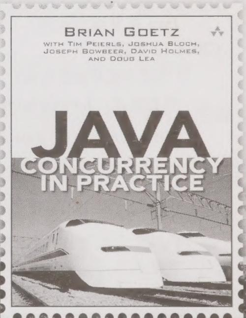

# JavaConcurrency in Practice

Brian Goetz  
Tim Peierls  
Joshua Bloch  
Joseph Bowbeer  
David Holmes  
Doug Lea  
童云兰 等译

本书深入浅出地介绍了Java线程和并发，是一本完美的Java并发参考手册。书中从并发性和线程安全性的基本概念出发，介绍了如何使用类库提供的基本并发构建块，用于避免并发危险、构造线程安全的类及验证线程安全的规则，如何将小的线程安全类组合成更大的线程安全类，如何利用线程来提高并发应用程序的吞吐量，如何识别可并行执行的任务，如何提高单线程子系统的响应性，如何确保并发程序执行预期任务，如何提高并发代码的性能和可伸缩性等内容，最后介绍了一些高级主题，如显式锁、原子变量、非阻塞算法以及如何开发自定义的同步工具类。

本书适合 Java 程序开发人员阅读。

Authorized translation from the English language edition, entitled JavaConcurrency in Practice, 9780321349606 by Brian Goetz, with Tim Peierls. et al., published by Pearson Education, Inc.

All rights reserved. No part of this book may be reproduced or transmitted in any form or by any means, electronic or mechanical, including photocopying, recording or by any information storage retrieval system, without permission from Pearson Education, Inc.

CHINESE SIMPLIFIED language edition published by PEARSON EDUCATION ASIA LTD., and CHINA MACHINE PRESS Copyright © 2012.

本书封底贴有 Pearson Education（培生教育出版集团）激光防伪标签，无标签者不得销售。

封底无防伪标均为盗版

版权所有，侵权必究

本书法律顾问：北京大成律师事务所 韩光/邹晓东

本书版权登记号：图字：01-2011-1513

图书在版编目（CIP）数据

Java并发编程实战/（美）盖茨（Goetz,B.）等著；童云兰等译．一北京：机械工业出版社，2012.2(2016.12重印)

（华章专业开发者丛书）

书名原文：JavaConcurrency in Practice

ISBN 978-7-111-37004-8

I.J… II. $①$ 盖… $②$ 童… III.JAVA语言－程序设计 IV.TP312

中国版本图书馆CIP数据核字（2011）第281977号

机械工业出版社（北京市西城区百万庄大街22号 邮政编码 100037）

责任编辑：关敏

北京市荣盛彩色印刷有限公司印刷

2016年12月第1版第17次印刷

$186\mathrm{mm}\times 240\mathrm{mm}\cdot 19.25$ 印张

标准书号：ISBN978-7-111-37004-8

定价：69.00元

凡购本书，如有缺页、倒页、脱页，由本社发行部调换。

客服热线：（010）88379426；88361066

购书热线：（010）68326294；88376949；68995259

投稿热线：（010）88379604

读者信箱：hzit@hzbook.com