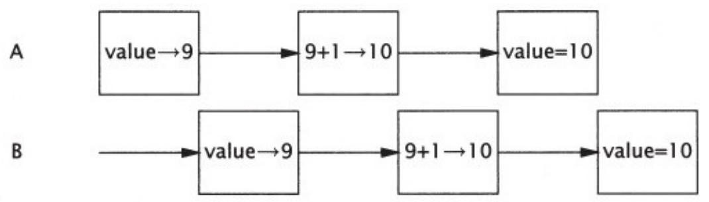

# 1.3.1 安全性问题

线程安全性可能是⾮常复杂的，在没有充⾜同步的情况下，多个线程中的操作执⾏顺序是不可预测的，甚⾄会产⽣奇怪的结果。在程序清单1-1的UnsafeSequence类中将产⽣⼀个整数值序列，该序列中的每个值都是唯⼀的。在这个类中简要地说明了多个线程之间的交替操作将如何导致不可预料的结果。在单线程环境中，这个类能正确地⼯作，但在多线程环境中则不能。

**程序清单1-1 ⾮线程安全的数值序列⽣成器**

```java
@NotThreadSafe   
public class UnsafeSequence{   
private int value;   
\*\*返回一个唯一的数值。\*/   
public int getNext() {   
return value++; 
```

UnsafeSequence的问题在于，如果执⾏时机不对，那么两个线程在调⽤getNext时会得到相同的值。在图1-1中给出了这种错误情况。虽然递增运算someVariable $^ { + + }$ 看上去是单个操作，但事实上它包含三个独⽴的操作：读取value，将value加1，并将计算结果写⼊value。由于运⾏时可能将多个线程之间的操作交替执⾏，因此这两个线程可能同时执⾏读操作，从⽽使它们得到相同的值，并都将这个值加1。结果就是，在不同线程的调⽤中返回了相同的数值。

  
图 1-1 UnsafeSequence.getNext（）的错误执⾏情况

在图1-1中给出了不同线程之间的⼀种交替执⾏情况。在图中，执⾏时序按照从左到右的顺序递增，每⾏表⽰⼀个线程的动作。这些交替执⾏⽰意图给出的是最糟糕的执⾏情况 [1]，⽬的是为了说明：如果错误地假设程序中的操作将按照某种特定顺序来执⾏，那么会存在各种可能的危险。

在UnsafeSequence中使⽤了⼀个⾮标准的标注：@NotThreadSafe。这是在本书中使⽤的⼏个⾃定义标注之⼀，⽤于说明类和类成员的并发属性。（其他标注包括@ThreadSafe和@Immutable，请参⻅附录A的详细信息）。线程安全性标注在许多⽅⾯都是有⽤的。如果⽤$@$ ThreadSafe来标注某个类，那么开发⼈员可以放⼼地在多线程环境下

使⽤这个类，维护⼈员也会发现它能保证线程安全性，⽽软件分析⼯具还可以识别出潜在的编码错误。

在UnsafeSequence类中说明的是⼀种常⻅的并发安全问题，称为竞态条件（Race Condition）。在多线程环境下，getValue是否会返回唯⼀的值，要取决于运⾏时对线程中操作的交替执⾏⽅式，这并不是我们希望看到的情况。

由于多个线程要共享相同的内存地址空间，并且是并发运⾏，因此它们可能会访问或修改其他线程正在使⽤的变量。当然，这是⼀种极⼤的便利，因为这种⽅式⽐其他线程间通信机制更容易实现数据共享。但它同样也带来了巨⼤的⻛险：线程会由于⽆法预料的数据变化⽽发⽣错误。当多个线程同时访问和修改相同的变量时，将会在串⾏编程模型中引⼊⾮串⾏因素，⽽这种⾮串⾏性是很难分析的。要使多线程程序的⾏为可以预测，必须对共享变量的访问操作进⾏协同，这样才不会在线程之间发⽣彼此⼲扰。幸运的是，Java提供了各种同步机制来协同这种访问。

通过将getNext修改为⼀个同步⽅法，可以修复UnsafeSequence中的错误，如程序清单1-2中的Sequence，这个类可以防⽌图1-1中错误的交替执⾏情况。（第2章和第3章将进⼀步分析这个类的⼯作原理。）

**程序清单1-2 线程安全的数值序列⽣成器**

@ThreadSafe

public class Sequence{

@GuardedBy（"this"）private int Value；

public synchronized int getNext（）{

return Value++；  
}   
}

如果没有同步，那么⽆论是编译器、硬件还是运⾏时，都可以随意安排操作的执⾏时间和顺序，例如对寄存器或者处理器中的变量进⾏缓存，⽽这些被缓存的变量对于其他线程来说是暂时（甚⾄永久）不可⻅的。虽然这些技术有助于实现更优的性能，并且通常也是值得采⽤的⽅法，但它们也为开发⼈员带来了负担，因为开发⼈员必须找出这些数据在哪些位置被多个线程共享，只有这样才能使这些优化措施不破坏线程安全性。（第16章将详细介绍JVM实现了哪些顺序保证，以及同步将如何影响这些保证，但如果遵循第2章和第3章给出的指导原则，那么就可以绕开这些底层细节问题。）

[1] 事实上，在第3章中将看到，由于存在指令重排序的可能，因此实际情况可能会更糟糕。