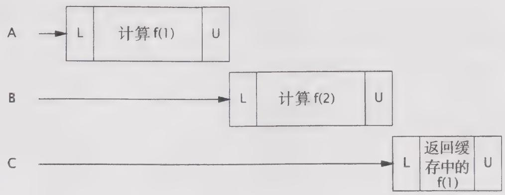
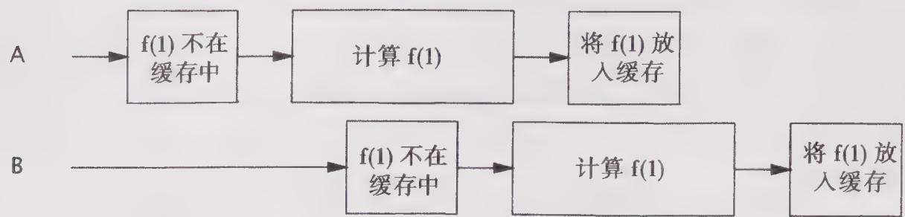
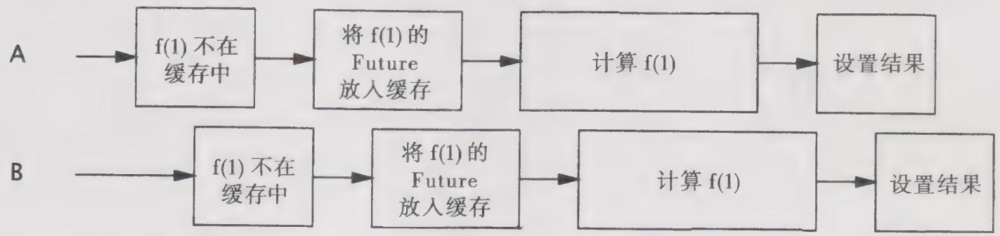

# 5.6 构建高效且可伸缩的结果缓存

几乎所有的服务器应用程序都会使用某种形式的缓存。重用之前的计算结果能降低延迟，提高吞吐量，但却需要消耗更多的内存。

像许多“重复发明的轮子”一样，缓存看上去都非常简单。然而，简单的缓存可能会将性能瓶颈转变成可伸缩性瓶颈，即使缓存是用于提升单线程的性能。本节我们将开发一个高效且可伸缩的缓存，用于改进一个高计算开销的函数。我们首先从简单的 HashMap 开始，然后分析它的并发性缺陷，并讨论如何修复它们。

在程序清单5-16的Computable $< \mathrm{A}$ ，V>接口中声明了一个函数Computable，其输入类型为A，输出类型为V。在ExpensiveFunction中实现的Computable，需要很长的时间来计算结果，我们将创建一个Computable包装器，帮助记住之前的计算结果，并将缓存过程封装起来。（这项技术被称为“记忆[Memoization]”。）

程序清单5-16 使用 HashMap和同步机制来初始化缓存  
```java
public interface Computable<A, V> {
    V compute(A arg) throws InterruptedException;
}  
public class ExpensiveFunction
    implements Computable<String, AtomicInteger> {
        public AtomicInteger compute(String arg) {
            // 在经过长时间的计算后
            return new AtomicInteger(arg);
        }
    }  
public class Memoizer1<A, V> implements Computable<A, V> {
        @GuardedBy("this")
        private final Map<A, V> cache = new HashMap<A, V>();
        private final Computable<A, V> c;
        public Memoizer1(Computable<A, V> c) {
            this.c = c;
        }
    }
public synchronized V compute(A arg) throws InterruptedException {
        V result = cache.get(arg);
        if (result == null) {
            result = c COMPUTE(arg);
            cache.put(arg, result);
        }
        return result;
    } 
```


在程序清单5-16中的Memoizer1给出了第一种尝试：使用 HashMap来保存之前计算的结果。compute方法将首先检查需要的结果是否已经在缓存中，如果存在则返回之前计算的值。否则，将把计算结果缓存在 HashMap中，然后再返回。

HashMap 不是线程安全的，因此要确保两个线程不会同时访问 HashMap，Memozer1 采用了一种保守的方法，即对整个 compute 方法进行同步。这种方法能确保线程安全性，但会带来一个明显的可伸缩性问题：每次只有一个线程能够执行 compute。如果另一个线程正在计算结果，那么其他调用 compute 的线程可能被阻塞很长时间。如果有多个线程在排队等待还未计算出的结果，那么 compute 方法的计算时间可能比没有“记忆”操作的计算时间更长。在图 5-2 中给出了当多个线程使用这种方法中的“记忆”操作时发生的情况，这显然不是我们希望通过缓存获得的性能提升结果。

  
图5-2 Memoizer1糟糕的并发性

程序清单5-17中的Memoizer2用 ConcurrentHashMap 代替 HashMap来改进 Memoizer1中糟糕的并发行为。由于 ConcurrentHashMap 是线程安全的，因此在访问底层Map时就不需要进行同步，因而避免了在对 Memoizer1 中的 compute 方法进行同步时带来的串行性。

Memoizer2 比 Memoizer1 有着更好的并发行为：多线程可以并发地使用它。但它在作为缓存时仍然存在一些不足——当两个线程同时调用 compute 时存在一个漏洞，可能会导致计算得到相同的值。在使用 memoization 的情况下，这只会带来低效，因为缓存的作用是避免相同的数据被计算多次。但对于更通用的缓存机制来说，这种情况将更为糟糕。对于只提供单次初始化的对象缓存来说，这个漏洞就会带来安全风险。

程序清单5-17 用 ConcurrentHashMap 替换 HashMap  
```java
public class Memoizer2<A, V> implements Computable<A, V> {
    private final Map<A, V> cache = new ConcurrentHashMap<A, V>();
    private final Computable<A, V> c;
    public Memoizer2(Computable<A, V> c) { this.c = c; }
    public V compute(A arg) throws扰乱Exception {
        V result = cache.get(arg);
        if (result == null) {
            result = c COMPUTE(arg);
            cache.put(arg, result);
        }
        return result;
    }
} 
```

Memoizer2 的问题在于，如果某个线程启动了一个开销很大的计算，而其他线程并不知道这个计算正在进行，那么很可能会重复这个计算，如图 5-3 所示。我们希望通过某种方法来表达“线程 X 正在计算 f(27)”这种情况，这样当另一个线程查找 f(27) 时，它能够知道最高效的方法是等待线程 X 计算结束，然后再去查询缓存“f(27) 的结果是多少？”

我们已经知道有一个类能基本实现这个功能：FutureTask、FutureTask 表示一个计算的过程，这个过程可能已经计算完成，也可能正在进行。如果有结果可用，那么 FutureTask.get 将立即返回结果，否则它会一直阻塞，直到结果计算出来再将其返回。

  
图5-3 当使用Memoizer2时，两个线程计算相同的值

程序清单5-18中的Memoizer3将用于缓存值的Map重新定义为 ConcurrentHashMap<A, Future<V>>，替换原来的 ConcurrentHashMap<A, V>。Memoizer3首先检查某个相应的计算是否已经开始（Memoizer2与之相反，它首先判断某个计算是否已经完成）。如果还没有启动，那么就创建一个FutureTask，并注册到Map中，然后启动计算：如果已经启动，那么等待现有计算的结果。结果可能很快会得到，也可能还在运算过程中，但这对于Future.get的调用者来说是透明的。

程序清单5-18 基于FutureTask的Memoizing封装器  
```java
public class Memoizer3<A, V> implements Computable<A, V> {
    private final Map<A, Future<V>> cache = new ConcurrentHashMap<A, Future<V>>(); 
    private final Computable<A, V> c;
public Memoizer3(Computable<A, V> c) { this.c = c; }
public V compute(final A arg) throws扰乱Exception {
    Future<V> f = cache.get(arg);
if (f == null) {
    Callable<V> eval = new Callable<V>() {
        public V call() throws扰乱Exception {
            return c.compute(arg);
        }
    };
FutureTask<V> ft = new FutureTask<V>(eval);
f = ft;
cache.put(arg, ft);
ft.run(); // 在这里将调用c COMPUTe
} 
try {
return f.get();
} catch (ExecutionException e) {
throw launderable(e.getCause());
}
} 
```

Memoizer3 的实现几乎是完美的：它表现出了非常好的并发性（基本上是源于 ConcurrentHashMap 高效的并发性），若结果已经计算出来，那么将立即返回。如果其他线程正在计算该结果，那么新到的线程将一直等待这个结果被计算出来。它只有一个缺陷，即仍然存在两个线程计算出相同值的漏洞。这个漏洞的发生概率要远小于 Memoizer2 中发生的概率，但


由于 compute 方法中的 if 代码块仍然是非原子 (nonatomic) 的“先检查再执行”操作，因此两个线程仍有可能在同一时间内调用 compute 来计算相同的值，即二者都没有在缓存中找到期望的值，因此都开始计算。这个错误的执行时序如图 5-4 所示。

  
图5-4 错误的执行时序将使得Memorizer3将相同的值计算两次

Memoizer3 中存在这个问题的原因是，复合操作（“若没有则添加”）是在底层的 Map 对象上执行的，而这个对象无法通过加锁来确保原子性。程序清单 5-19 中的 Memoizer 使用了 ConcurrentMap 中的原子方法 putIfAbsent，避免了 Memoizer3 的漏洞。

程序清单5-19 Memoizer的最终实现   
```java
public class Memoizer<A, V> implements Computable<A, V> {
    private final ConcurrentMap<A, Future<V>> cache = new ConcurrentHashMap<A, Future<V>>();
    private final Computable<A, V> c;
public Memoizer(Computable<A, V> c) { this.c = c; }
public V compute(final A arg) throws扰乱Exception {
    while (true) {
        Future<V> f = cache.get(arg);
        if (f == null) {
            Callable<V> eval = new Callable<V>() {
                public V call() throws扰乱Exception {
                    return c.compute(arg);
            }
        }
        FutureTask<V> ft = new FutureTask<V>(eval);
        f = cache.putIfAbsent(arg, ft);
        if (f == null) { f = ft; ft.run(); }
    }
    try {
        return f.get();
    } catch (CancellationException e) {
        cache.remove(arg, f);
    } catch (ExecutionException e) {
        throw LAnderThrowable(e.getCause());
    }
} 
```

计算被取消或者失败，那么在计算这个结果时将指明计算过程被取消或者失败。为了避免这种情况，如果 Memoizer 发现计算被取消，那么将把 Future 从缓存中移除。如果检测到RuntimeException, 那么也会移除 Future，这样将来的计算才可能成功。Memoizer 同样没有解决缓存逾期的问题，但它可以通过使用 FutureTask 的子类来解决，在子类中为每个结果指定一个逾期时间，并定期扫描缓存中逾期的元素。（同样，它也没有解决缓存清理的问题，即移除旧的计算结果以便为新的计算结果腾出空间，从而使缓存不会消耗过多的内存。）

在完成并发缓存的实现后，就可以为第2章中因式分解servlet添加结果缓存。程序清单5-20中的Factorizer使用Memoizer来缓存之前的计算结果，这种方式不仅高效，而且可扩展性也更高。

程序清单5-20 在因式分解servlet中使用Memoizer来缓存结果  
@ThreadSafe   
public class Factorizer implements Servlet { private final Computable<BigInt,BigInt[] $\rightharpoondown$ c $=$ newComputable<BigInt,BigInt[] $\rightharpoonup$ () { publicBigInt[] compute(Biglnterarg){ return factor(arg); } 1 private final Computable<BigInt,BigInt[]> cache $=$ new Memoizer<BigInt,BigInt[]>(c); public void service(ServletRequest req, ServletResponse resp) { try{ AtomicInteger i $=$ extractFromRequestreq); encodeIntoResponse(resp，cache.compute(i)); } catch (InterruptedException e) { encodeError(resp，"factorization interrupted"); } }