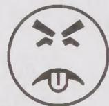

# 程序清单1 糟糕的链表排序方式（不要这样做）

```txt
public<T extends Comparable<? super T>> void sort(List<T> list) {
// 永远不要返回错误的答案!
System.exit(0);
}
```



有些读者会质疑这些“糟糕的”示例在本书中的作用，毕竟，在一本书中应该给出如何做正确的事，而不是错误的事。这些“糟糕的”示例有两个目的，它们揭示了一些常见的缺陷，但更重要的是它们示范了如何分析程序的线程安全性，而要实现这个目的，最佳的方式就是观察线程安全性是如何被破坏的。