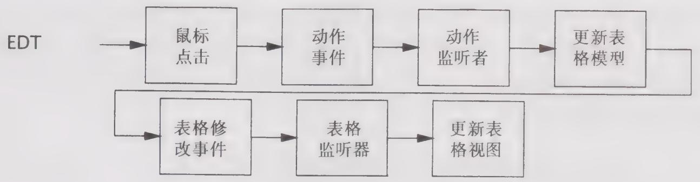

# 9.2 短时间的GUI任务

在GUI应用程序中，事件在事件线程中产生，并通过“气泡上升”的方式传递给应用程序提供的监听器，而监听器则根据收到的时间执行一些计算来修改表现对象。为了简便，短时间的任务可以把整个操作都放在事件线程中执行，而对于长时间的任务，则应该将某些操作放到另一个线程中执行。

在这种情况下，表现对象封闭在事件线程中。程序清单9-3创建了一个按钮，它的颜色在被按下时会随机地变化。当用户点击按钮时，工具包将事件线程中的一个ActionEvent投递给所有已注册的ActionListener。作为响应，ActionListener将选择一个新的颜色，并将按钮的背景色设置为这个新颜色。这样，在GUI工具包中产生事件，然后发送到应用程序，而应用程序则通过修改GUI来响应用户的动作。在这期间，执行控制始终不会离开事件线程，如图9-1所示。

  
图9-1 按钮点击时的执行控制流

程序清单9-3 简单的事件监听器  
```txt
final Random random = new Random();  
final JButton button = new JButton("Change Color");  
...  
button.addActionListener(new ActionListener() {  
    public void actionPerformed(ActionEvent e) {  
        button.setBackground(new Color(random.nextInt());  
    }  
}); 
```

这个示例揭示了GUI应用程序和GUI工具包之间的主要交互。只要任务是短期的，并且只访问GUI对象（或者其他线程封闭或线程安全的应用程序对象），那么就可以基本忽略与线程相关的问题，而在事件线程中可以执行任何操作都不会出问题。

图9-2给出了一个略微复杂的版本，其中使用了正式的数据模型，例如TableModel或TreeModel。Swing将大多数可视化组件都分为两个对象，即模型对象与视图对象。在模型对象中保存的是将被显示的数据，而在视图对象中则保存了控制显示方式的规则。模型对象可以通过引发事件来表示模型数据发生了变化，而视图对象则通过“订阅”来接收这些事件。当视图对象收到表示模型数据已发生变化的事件时，将向模型对象查询新的数据，并更新界面显示。因此，在一个修改表格内容的按钮监听器中，事件监听器将更新模型并调用其中一个fireXxx方法，这个方法会依次调用视图对象中表格模型监听器，从而更新视图的显示。同样，执行控制权仍然不会离开事件线程。（Swing数据模型的fireXxx方法通常会直接调用模型监听器，而不会向线程队列中提交新的事件，因此fireXxx方法只能从事件线程中调用。）

  
图9-2 模型对象与视图对象的控制流