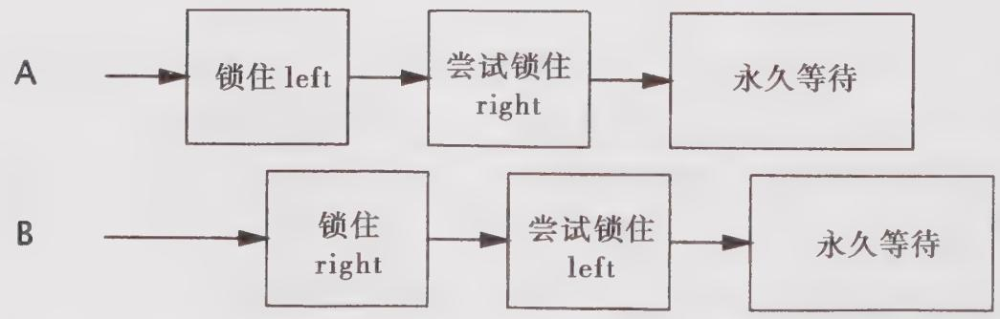

# 10.1.1 锁顺序死锁

程序清单10-1中的LeftRightDeadlock存在死锁风险。leftRight和rightLeft这两个方法分别获得left锁和right锁。如果一个线程调用了leftRight，而另一个线程调用了rightLeft，并且这两个线程的操作是交错执行，如图10-1所示，那么它们会发生死锁。

  
图10-1 LeftRightDeadlock中的不当执行时机

在LeftRightDeadlock中发生死锁的原因是：两个线程试图以不同的顺序来获得相同的锁。如果按照相同的顺序来请求锁，那么就不会出现循环的加锁依赖性，因此也就不会产生死锁。如果每个需要锁L和锁M的线程都以相同的顺序来获取L和M，那么就不会发生死锁了。

如果所有线程以固定的顺序来获得锁，那么在程序中就不会出现锁顺序死锁问题。

要想验证锁顺序的一致性，需要对程序中的加锁行为进行全局分析。如果只是单独地分析每条获取多个锁的代码路径，那是不够的：leftRight 和 rightLeft 都采用了“合理的”方式来获得锁，它们只是不能相互兼容。当需要加锁时，它们需要知道彼此正在执行什么操作。

程序清单10-1 简单的锁顺序死锁（不要这么做）  
//注意：容易发生死锁！   
public class LeftRightDeadlock{ private final Object left $=$ new Object(); private final Object right $=$ new Object(); public void leftRight() { synchronized(left){ synchronized(right){ doSomething(); } }   
public void rightLeft(){ synchronized(right){ synchronized(left){ doSomethingElse(); } 1   
}

