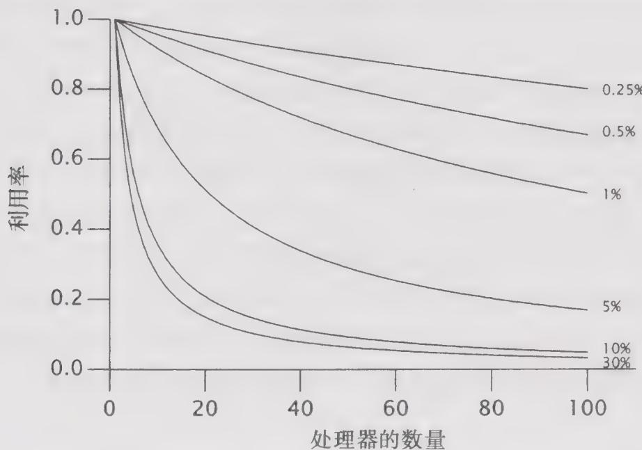

# 11.2 Amdahl定律

在有些问题中，如果可用资源越多，那么问题的解决速度就越快。例如，如果参与收割庄稼的工人越多，那么就能越快地完成收割工作。而有些任务本质上是串行的，例如，即使增加再多的工人也不可能增加作物的生长速度。如果使用线程主要是为了发挥多个处理器的处理能力，那么就必须对问题进行合理的并行分解，并使得程序能有效地使用这种潜在的并行能力。

大多数并发程序都与农业耕作有着许多相似之处，它们都是由一系列的并行工作和串行工作组成的。Amdahl定律描述的是：在增加计算资源的情况下，程序在理论上能够实现最高加速比，这个值取决于程序中可并行组件与串行组件所占的比重。假定 $F$ 是必须被串行执行的部分，那么根据Amdahl定律，在包含 $N$ 个处理器的机器中，最高的加速比为：

$$
S p e e d u p \leqslant \frac {1}{F + \frac {(1 - F)}{N}}
$$

当 $N$ 趋近无穷大时，最大的加速比趋近于 $1 / F$ 。因此，如果程序有 $50\%$ 的计算需要串行执行，那么最高的加速比只能是2（而不管有多少个线程可用）；如果在程序中有 $10\%$ 的计算需要串行执行，那么最高的加速比将接近10。Amdahl定律还量化了串行化的效率开销。在拥有10个处理器的系统中，如果程序中有 $10\%$ 的部分需要串行执行，那么最高的加速比为5.3（ $53\%$ 的使用率），在拥有100个处理器的系统中，加速比可以达到9.2（ $9\%$ 的使用率）。即使拥有无限多的CPU，加速比也不可能为10。

图11-1给出了处理器利用率在不同串行比例以及处理器数量情况下的变化曲线。（利用率的定义为：加速比除以处理器的数量。）随着处理器数量的增加，可以很明显地看到，即使串行部分所占的百分比很小，也会极大地限制当增加计算资源时能够提升的吞吐率。

  
图11-1 在串行部分所占不同比例下的最高利用率

第6章介绍了如何识别任务的逻辑边界并将应用程序分解为多个子任务。然而，要预测应用程序在某个多处理器系统中将实现多大的加速比，还需要找出任务中的串行部分。

假设应用程序中 $N$ 个线程正在执行程序清单11-1中的doWork，这些线程从一个共享的工作队列中取出任务进行处理，而且这里的任务都不依赖于其他任务的执行结果或影响。暂时先不考虑任务是如何进入这个队列的，如果增加处理器，那么应用程序的性能是否会相应地发生变化？初看上去，这个程序似乎能完全并行化：各个任务之间不会相互等待，因此处理器越多，能够并发处理的任务也就越多。然而，在这个过程中包含了一个串行部分——从队列中获取任务。所有工作者线程都共享同一个工作队列，因此在对该队列进行并发访问时需要采用某种同步机制来维持队列的完整性。如果通过加锁来保护队列的状态，那么当一个线程从队列中取出任务时，其他需要获取下一个任务的线程就必须等待，这就是任务处理过程中的串行部分。

程序清单11-1 对任务队列的串行访问  
```java
public class WorkerThread extends Thread { private final BlockingQueue<Runnable> queue; public WorkerThread(BlockingQueue<Runnable> queue) { this.queue = queue; } public void run() { while (true) { try { Runnable task = queue.take(); task.run(); } catch (InterruptedException e) { break; /* 允许线程退出 */ } } } } 
```

单个任务的处理时间不仅包括执行任务 Runnable 的时间，也包括从共享队列中取出任务的时间。如果使用 LinkedBlockingQueue 作为工作队列，那么出列操作被阻塞的可能性将小于使用同步 LinkedList 时发生阻塞的可能性，因为 LinkedBlockingQueue 使用了一种可伸缩性更高的算法。然而，无论访问何种共享数据结构，基本上都会在程序中引入一个串行部分。

这个示例还忽略了另一种常见的串行操作：对结果进行处理。所有有用的计算都会生成某种结果或者产生某种效应——如果不会，那么可以将它们作为“死亡代码”删除掉。由于Runnable 没有提供明确的结果处理过程，因此这些任务一定会产生某种效果，例如将它们的结果写入到日志或者保存到某个数据结构。通常，日志文件和结果容器都会由多个工作者线程共享，并且这也是一个串行部分。如果所有线程都将各自的计算结果保存到自行维护数据结构中，并且在所有任务都执行完成后再合并所有的结果，那么这种合并操作也是一个串行部分。

在所有并发程序中都包含一些串行部分。如果你认为在你的程序中不存在串行部分，那么可以再仔细检查一遍。