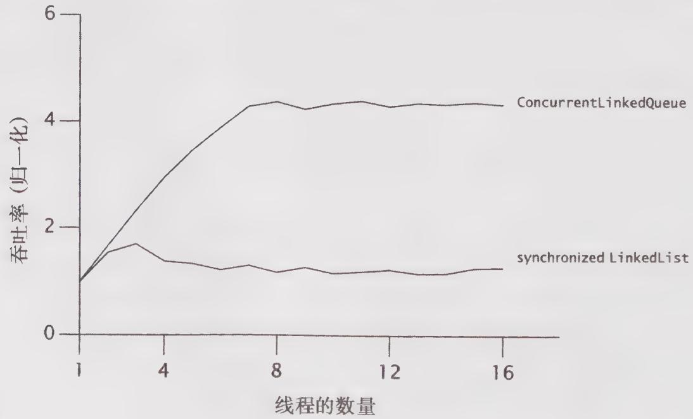

# 11.2.1 示例：在各种框架中隐藏的串行部分

要想知道串行部分是如何隐藏在应用程序的架构中，可以比较当增加线程时吞吐量的变化，并根据观察到的可伸缩性变化来推断串行部分中的差异。图11-2给出了一个简单的应用程序，其中多个线程反复地从一个共享Queue中取出元素进行处理，这与程序清单11-1很相似。处理步骤只需执行线程本地的计算。如果某个线程发现队列为空，那么它将把一组新元素放入队列，因而其他线程在下一次访问时不会没有元素可供处理。在访问共享队列的过程中显然存在着一定程度的串行操作，但处理步骤完全可以并行执行，因为它不会访问共享数据。

  
图11-2 比较不同队列的实现

图11-2的曲线对两个线程安全的Queue的吞吐率进行了比较：其中一个是采用synchronizedList封装的LinkedList；另一个是 ConcurrentLinkedQueue。这些测试在8路 Sparc V880系

统上运行，操作系统为Solaris。尽管每次运行都表示相同的“工作量”，但我们可以看到，只需改变队列的实现方式，就能对可伸缩性产生明显的影响。

ConcurrentLinkedQueue 的吞吐量不断提升，直到到达了处理器数量上限，之后将基本保持不变。另一方面，当线程数量小于 3 时，同步 LinkedList 的吞吐量也会有某种程度的提升，但是之后会由于同步开销的增加而下跌。当线程数量达到 4 个或 5 个时，竞争将非常激烈，甚至每次访问队列都会在锁上发生竞争，此时的吞吐量主要受到上下文切换的限制。

吞吐量的差异来源于两个队列中不同比例的串行部分。同步的LinkedList采用单个锁来保护整个队列的状态，并且在offer和remove等方法的调用期间都将持有这个锁。ConcurrentLinkedQueue使用了一种更复杂的非阻塞队列算法（请参见15.4.2节），该算法使用原子引用来更新各个链接指针。在第一个队列中，整个的插入或删除操作都将串行执行，而在第二个队列中，只有对指针的更新操作需要串行执行。