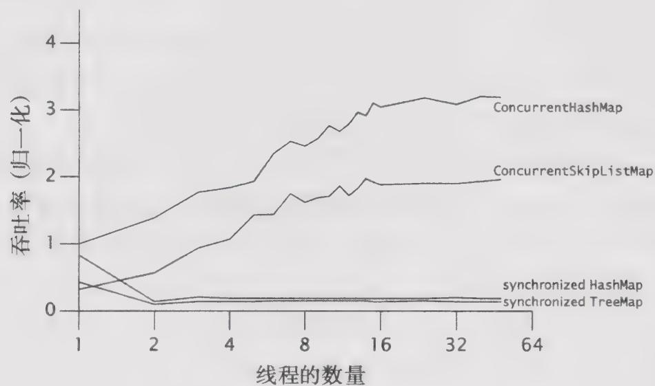

# 11.5 示例：比较Map的性能

在单线程环境下，ConcurrentHashMap 的性能比同步的 HashMap 的性能略好一些，但在并发环境中则要好得多。在 ConcurrentHashMap 的实现中假设，大多数常用的操作都是获取某个已经存在的值，因此它对各种 get 操作进行了优化从而提供最高的性能和并发性。

在同步Map的实现中，可伸缩性的最主要阻碍在于整个Map中只有一个锁，因此每次只有一个线程能够访问这个Map。不同的是，ConcurrentHashMap对于大多数读操作并不会加锁，并且在写入操作以及其他一些需要锁的读操作中使用了锁分段技术。因此，多个线程能并发地访问这个Map而不会发生阻塞。

图11-3给出了几种Map实现在可伸缩上的差异：ConcurrentHashMap、ConcurrentSkipListMap，以及通过synchronizedMap来包装的HashMap和TreeMap。前两种Map是线程安全的，而后

两个Map则通过同步封装器来确保线程安全性。每次运行时，将有 $N$ 个线程并发地执行一个紧凑的循环：选择一个随机的键值，并尝试获取与这个键值相对应的值。如果不存在相应的值，那么将这个值增加到Map的概率为 $p = 0.6$ ，如果存在相应的值，那么删除这个值的概率为 $p = 0.02$ 。这个测试在8路Sparc V880系统上运行，基于Java 6环境，并且在图中给出了将ConcurrentHashMap归一化为单个线程时的吞吐量。（并发容器与同步容器在可伸缩性上的差异比在Java 5.0中更加明显。）

  
图11-3 不同Map实现的可伸缩性比较

ConcurrentHashMap 和 ConcurrentSkipListMap 的数据显示，它们在线程数量增加时能表现出很好的可伸缩性，并且吞吐量会随着线程数量的增加而增加。虽然图 11-3 中的线程数量并不大，但与普通的应用程序相比，这个测试程序在每个线程上生成了更多的竞争，因为它除了向 Map 施加压力外几乎没有执行任何其他操作，而实际的应用程序通常会在每次迭代中进行一些线程本地工作。

同步容器的数量并非越多越好。单线程情况下的性能与 ConcurrentHashMap 的性能基本相当，但当负载情况由非竞争性转变成竞争性时——这里是两个线程，同步容器的性能将变得糟糕。在伸缩性受到锁竞争限制的代码中，这是一种常见的行为。只要竞争程度不高，那么每个操作消耗的时间基本上就是实际执行工作的时间，并且吞吐量会因为线程数的增加而增加。当竞争变得激烈时，每个操作消耗的时间大部分都用于上下文切换和调度延迟，而再加入更多的线程也不会提高太多的吞吐量。