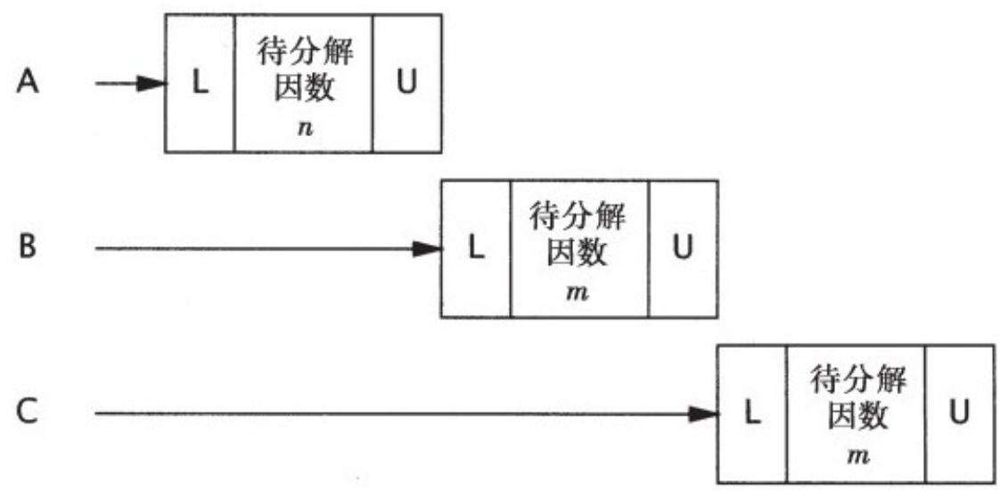

# 2.5 活跃性与性能

在UnsafeCachingFactorizer中，我们通过在因数分解Servlet中引⼊了缓存机制来提升性能。在缓存中需要使⽤共享状态，因此需要通过同步来维护状态的完整性。然⽽，如果使⽤SynchronizedFactorizer中的同步⽅式，那么代码的执⾏性能将⾮常糟糕。SynchronizedFactorizer中采⽤的同步策略是，通过Servlet对象的内置锁来保护每⼀个状态变量，该策略的实现⽅式也就是对整个service⽅法进⾏同步。虽然这种简单且粗粒度的⽅法能确保线程安全性，但付出的代价却很⾼。

由于service是⼀个synchronized⽅法，因此每次只有⼀个线程可以执⾏。这就背离了Serlvet框架的初衷，即Serlvet需要能同时处理多个请求，这在负载过⾼的情况下将给⽤户带来糟糕的体验。如果Servlet在对某个⼤数值进⾏因数分解时需要很⻓的执⾏时间，那么其他的客户端必须⼀直等待，直到Servlet处理完当前的请求，才能开始另⼀个新的因数分解运算。如果在系统中有多个CPU系统，那么当负载很⾼时，仍然会有处理器处于空闲状态。即使⼀些执⾏时间很短的请求，⽐如访问缓存的值，仍然需要很⻓时间，因为这些请求都必须等待前⼀个请求执⾏完成。

图2-1给出了当多个请求同时到达因数分解Servlet时发⽣的情况：这些请求将排队等待处理。我们将这种Web应⽤程序称之为不良并发（Poor Concurrency）应⽤程序：可同时调⽤的数量，不仅受到可⽤处理资源的限制，还受到应⽤程序本⾝结构的限制。幸运的是，通过缩⼩同步代码块的作⽤范围，我们很容易做到既确保Servlet的并发性，同时⼜维护线程安全性。要确保同步代码块不要过⼩，并且不要将本应是原⼦的操作拆分到多个同步代码块中。应该尽量将不影响共享状态且执⾏时间较⻓的操作从同步代码块中分离出去，从⽽在这些操作的执⾏过程中，其他线程可以访问共享状态。

  
图 2-1 SynchronizedFactorizer中的不良并发

程序清单2-8中的CachedFactorizer将Servlet的代码修改为使⽤两个独⽴的同步代码块，每个同步代码块都只包含⼀⼩段代码。其中⼀个同步代码块负责保护判断是否只需返回缓存结果的“先检查后执⾏”操作序列，另⼀个同步代码块则负责确保对缓存的数值和因数分解结果进⾏同步更新。此外，我们还重新引⼊了“命中计数器”，添加了⼀个“缓存命中”计数器，并在第⼀个同步代码块中更新这两个变量。由于这两个计数器也是共享可变状态的⼀部分，因此必须在所有访问它们的位置上都使⽤同步。位于同步代码块之外的代码将以独占⽅式来访问局部（位于栈上的）变量，这些变量不会在多个线程间共享，因此不需要同步。

程序清单2-8 缓存最近执⾏因数分解的数值及其计算结果的Servlet

@ThreadSafe

public class CachedFactorizer implements Servlet{

@GuardedBy（"this"）private BigInteger lastNumber；

@GuardedBy（"this"）private BigInteger[]lastFactors；

@GuardedBy（"this"）private long hits；

@GuardedBy（"this"）private long cacheHits；

public synchronized long getHits（）{return hits；}

public synchronized double getCacheHitRatio（）{

return（double）cacheHits/（double）hits；

}

public void service（ServletRequest req, ServletResponse resp）{

BigInteger i=extractFromRequest（req）；

BigInteger[]factors=null；

synchronized（this）{

++hits；

if（i.equals（lastNumber））{

++cacheHits；

factor $\mathtt { S } \mathtt { = }$ lastFactors.clone（）；

}

}

if（factors==null）{

factors=factor（i）；

synchronized（this）{

lastNumber $\equiv$ i;   
lastFactors $=$ factors.clone();   
}   
}   
encodeIntoResponse (resp, factors) ;   
}

在CachedFactorizer中不再使⽤AtomicLong类型的命中计数器，⽽是使⽤了⼀个long类型的变量。当然也可以使⽤AtomicLong类型，但使⽤CountingFactorizer带来的好处更多。对在单个变量上实现原⼦操作来说，原⼦变量是很有⽤的，但由于我们已经使⽤了同步代码块来构造原⼦操作，⽽使⽤两种不同的同步机制不仅会带来混乱，也不会在性能或安全性上带来任何好处，因此在这⾥不使⽤原⼦变量。

重新构造后的CachedFactorizer实现了在简单性（对整个⽅法进⾏同步）与并发性（对尽可能短的代码路径进⾏同步）之间的平衡。在获取与释放锁等操作上都需要⼀定的开销，因此如果将同步代码块分解得过细（例如将 $^ { + + }$ hits分解到它⾃⼰的同步代码块中），那么通常并不好，尽管这样做不会破坏原⼦性。当访问状态变量或者在复合操作的执⾏期间，CachedFactorizer需要持有锁，但在执⾏时间较⻓的因数分解运算之前要释放锁。这样既确保了线程安全性，也不会过多地影响并发性，⽽且在每个同步代码块中的代码路径都“⾜够短”。

要判断同步代码块的合理⼤⼩，需要在各种设计需求之间进⾏权衡，包括安全性（这个需求必须得到满⾜）、简单性和性能。有时候，在

简单性与性能之间会发⽣冲突，但在CachedFactorizer中已经说明了，在⼆者之间通常能找到某种合理的平衡。

通常，在简单性与性能之间存在着相互制约因素。当实现某个同步策略时，⼀定不要盲⽬地为了性能⽽牺牲简单性（这可能会破坏安全性）。

当使⽤锁时，你应该清楚代码块中实现的功能，以及在执⾏该代码块时是否需要很⻓的时间。⽆论是执⾏计算密集的操作，还是在执⾏某个可能阻塞的操作，如果持有锁的时间过⻓，那么都会带来活跃性或性能问题。

当执⾏时间较⻓的计算或者可能⽆法快速完成的操作时（例如，⽹络I/O或控制台I/O），⼀定不要持有锁。