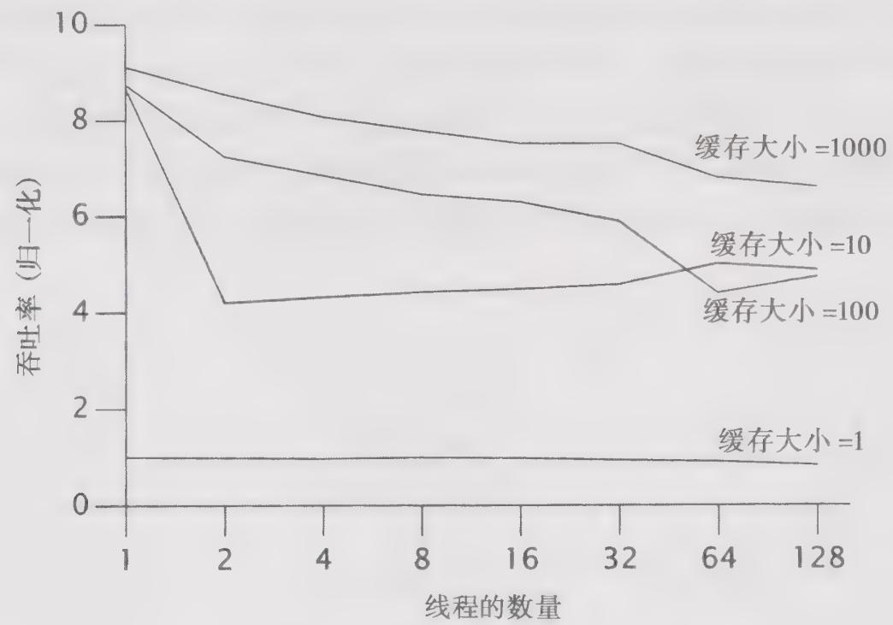

# 程序清单12-11 基于栅栏的定时器

```java
this timer = new BarrierTimer();  
this.barrier = new CyclicBarrier(npairs * 2 + 1, timer);  
public class BarrierTimer implements Runnable {  
    private boolean started;  
    private longstartTime,EndTime;  
    public synchronized void run() {  
        long t = System.nanoTime();  
        if (!started) {  
            started = true;  
           startTime = t;  
        } else  
           EndTime = t;  
    }  
    public synchronized void clear() {  
        started = false;  
    } 
```

```txt
public synchronized long getTime() { return endTime -startTime; } 
```

我们可以将栅栏的初始化过程修改为使用这种栅栏动作，即使用能接受栅栏动作的CyclicBarrier构造函数。

在修改后的test方法中使用了基于栅栏的计时器，如程序清单12-12所示。

程序清单12-12 采用基于栅栏的定时器进行测试  
```java
public void test() { try { timer.clear(); for (int i = 0; i < nPairs; i++) { pool.execute(new Producer()); pool.execute(new Consumer()); } barrier await(); barrier await(); long nsPerItem = timer.getTime() / (nPairs* (long)nTrials); System.out.print("Throughput: " + nsPerItem + " ns/item"); assertEquals(putSum.get(), takeSum.get()); } catch (Exception e) { throw new RuntimeException(e); } } 
```

我们可以从 TimedPutTakeTest 的运行中学到一些东西。第一，生产者 - 消费者模式在不同参数组合下的吞吐率。第二，有界缓存在不同线程数量下的可伸缩性。第三，如何选择缓存的大小。要回答这些问题，需要对不同的参数组合进行测试，因此我们需要一个主测试驱动程序，如程序清单 12-13 所示。

程序清单12-13 使用TimedPutTakeTest的程序  
```java
public static void main(String[] args) throws Exception {  
    int tpt = 100000; // 每个线程中的测试次数  
    for (int cap = 1; cap <= 1000; cap *= 10) {  
        System.out.println("Capacity: " + cap);  
    }  
    for (int pairs = 1; pairs <= 128; pairs *= 2) {  
        TimedPutTakeTest t = new TimedPutTakeTest(cap, pairs, tpt);  
        System.out.print("Pairs: " + pairs + "\t");  
        t.test();  
        System.out.print("\\t");  
        Thread.sleep(1000);  
        t.test();  
        System.out.println();  
        Thread.sleep(1000); 
```

```scss
}   
}   
pool.shutdown();   
} 
```

图12-1给出了在4路机器上的一些测试结果，缓存的容量分别为1、10、100和1000。我们可以看到，当缓存大小为1时，吞吐率是非常糟糕的，这是因为每个线程在阻塞并且等待另一个线程之前，所取得的进展是非常有限的。当把缓存大小提高到10时，吞吐率得到了极大提高：但在超过10之后，所得到的收益又开始降低。

  
图12-1 在不同缓存大小下的TimedPutTakeTest

初看起来会感到有些困惑：当增加更多的线程时，性能却略有下降。其中的原因很难从数据中看出来，但可以在运行测试时使用CPU的性能工具（例如perfbar）：虽然有许多的线程，但却没有足够多的计算量，并且大部分时间都消耗在线程的阻塞和解除阻塞等操作上。线程有足够多的CPU空闲时钟周期来做相同的事情，因此不会过多地降低性能。

然而，要谨慎对待从上面数据中得出的结论，即在使用有界缓存的生产者－消费者程序中总是可以添加更多的线程。这个测试在模拟应用程序时忽略了许多实际的因素，例如生产者几乎不需要任何工作就可以生成一个元素并将它放入队列，同时消费者也无须太多工作就能获取一个元素。在真实的生产者－消费者应用程序中，如果工作者线程要通过执行一些复杂的操作来生产和获取各个元素条目（通常就是这种情况），那么之前那种CPU空闲状态将消失，并且由于线程过多而导致的影响将变得非常明显。这个测试的主要目的是，测量生产者和消费者在通过有界缓存传递数据时，哪些约束条件将对整体吞吐量产生影响。