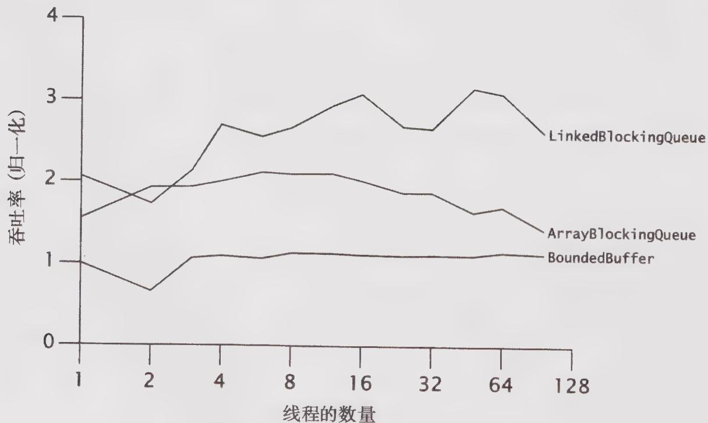

# 12.2.2 多种算法的比较

虽然 BoundedBuffer 是一种非常合理的实现，并且它的执行性能也不错，但还是没有 ArrayBlockingQueue 或 LinkedBlockingQueue 那样好（这也解释了为什么这种缓存算法没有被

选入类库中）。java.util.concurrent中的算法已经通过类似的测试进行了调优，其性能也已经达到我们已知的最佳状态。此外，这些算法还能提供更多的功能。BoundedBuffer运行效率不高的主要原因是：在put和take方法中都含有多个可能发生竞争的操作，例如，获取一个信号量，获取一个锁，以及释放信号量等。在其他实现方法中，可能发生竞争的位置将少很多。

图12-2给出了一个在双核超线程机器上对这三个类的吞吐量测试结果，在测试中使用了一个包含256个元素的缓存，以及相应版本的TimedPutTakeTest。测试结果表明，LinkedBlockingQueue的可伸缩性要高于ArrayBlockingQueue。初看起来，这个结果有些奇怪：链表队列在每次插入元素时，都必须分配一个链表节点对象，这似乎比基于数组的队列执行了更多的工作。然而，虽然它拥有更好的内存分配与GC等开销，但与基于数组的队列相比，链表队列的put和take等方法支持并发性更高的访问，因为一些优化后的链接队列算法能将队列头节点的更新操作与尾节点的更新操作分离开来。由于内存分配操作通常是线程本地的，因此如果算法能通过多执行一些内存分配操作来降低竞争程度，那么这种算法通常具有更高的可伸缩性。（这种情况再次证明了，基于传统性能调优的直觉与提升可伸缩性的实际需求是背道而驰的。）

  
图12-2 比较不同的阻塞队列实现