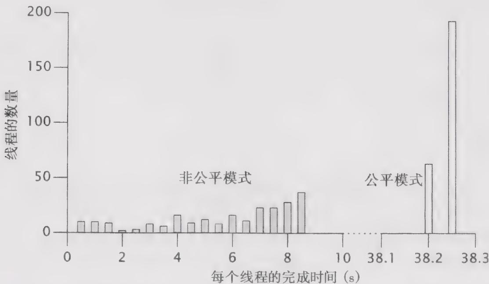
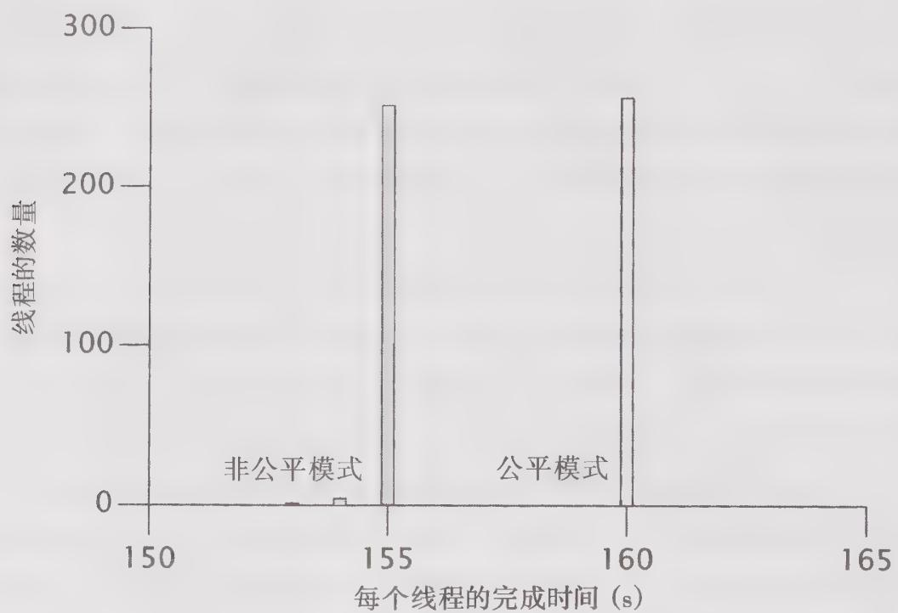

# 12.2.3 响应性衡量

到目前为止，我们的重点是吞吐量的测量，这通常是并发程序最重要的性能指标。但有时候，我们还需要知道某个动作经过多长时间才能执行完成，这时就要测量服务时间的变化情况。而且，如果能获得更小的服务时间变动性，那么更长的平均服务时间是有意义的，“可预测性”同样是一个非常有价值的性能特征。通过测量变动性，使我们能回答一些关于服务质量的问题，例如“操作在100毫秒内成功执行的百分比是多少？”

通过表示任务完成时间的直方图，最能看出服务时间的变动。服务时间变动的测量比平均值的测量要略困难一些——除了总共完成时间外，还要记录每个任务的完成时间。因为计时器的粒度通常是测量任务时间的一个主要因素（任务的执行时间可能小于或接近于最小“定时器计时单位”，这将影响测量结果的精确性），为了避免测量过程中的人为影响，我们可以测量一组put和take方法的运行时间。

图12-3给出了在不同TimedPutTakeTest中每个任务的完成时间，其中使用了一个大小为1000的缓存，有256个并发任务，并且每个任务都将使用非公平的信号量（隐蔽栅栏，ShadedBars）和公平的信号量（开放栅栏，openbars）来迭代这1000个元素。（13.3节将介绍锁和信号量的公平排队与非公平排队。）非公平信号量完成时间的变动范围为104到8714毫秒，相差超过80倍。通过在同步控制中实现更高的公平性，可以缩小这种变动范围，通过在BoundedBuffer中将信号量初始化为公平模式，可以很容易实现这个功能。如图12-3所示，这种方法能成功地降低变动性（现在的变动范围为38194到38207毫秒），然而，该方法会极大地降低吞吐量。（如果在一个运行时间较长的测试中执行更多种任务，那么吞吐量的下降程度可能更大。）

  
图12-3 TimedPutTakeTest在使用默认（非公平）信号量与公平信号量下的完成时间直方图

前面曾讨论过，如果缓存过小，那么将导致非常多的上下文切换次数，这即使在非公平模式中也会导致很低的吞吐量，因此在几乎每个操作中都会执行上下文切换。为了说明公平性开销主要是由于线程阻塞而造成的，我们可以将缓存大小设置为1，然后重新运行这个测试，从而可以看出此时非公平信号量与公平信号量的执行性能基本相当。如图12-4所示，这种情况下公平性并不会使平均完成时间变长，或者使变动性变小。

因此，除非线程由于密集的同步需求而被持续地阻塞，否则非公平的信号量通常能实现更好的吞吐量，而公平的信号量则实现更低的变动性。因为这些结果之间的差异非常大，所以Semaphore 要求客户选择针对哪一个特性进行优化。

  
图12-4 TimedPutTakeTest在使用单元素缓存时的完成时间直方图