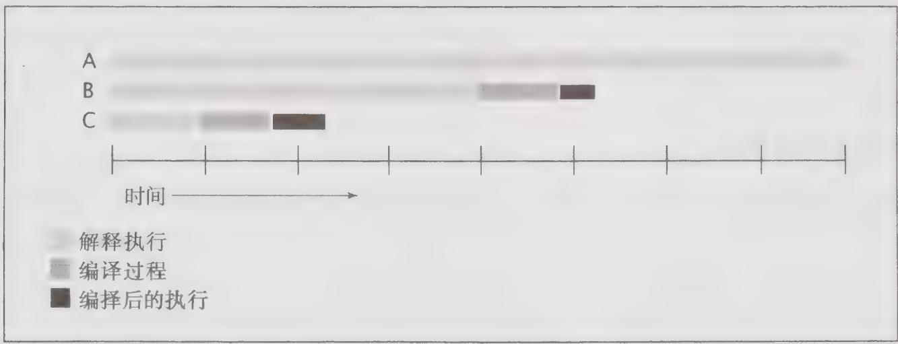

# 12.3.2 动态编译

与静态编译语言（例如，C 或 $\mathrm{C}++$ ）相比，编写动态编译语言（例如 Java）的性能基准测试要困难得多。在 HotSpot JVM（以及其他现代的 JVM）中将字节码的解释与动态编译结合起

来使用。当某个类第一次被加载时，JVM会通过解译字节码的方式来执行它。在某个时刻，如果一个方法运行的次数足够多，那么动态编译器会将它编译为机器代码，当编译完成后，代码的执行方式将从解释执行变成直接执行。

这种编译的执行时机是无法预测的。只有在所有代码都编译完成以后，才应该统计测试的运行时间。测量采用解释执行的代码速度是没有意义的，因为大多数程序在运行足够长的时间后，所有频繁执行的代码路径都会被编译。如果编译器可以在测试期间运行，那么将在两个方面对测试结果带来偏差：在编译过程中将消耗CPU资源，并且，如果在测量的代码中既包含解释执行的代码，又包含编译执行的代码，那么通过测试这种混合代码得到的性能指标没有太大意义。图12-5给出了动态编译在测试结果上带来的偏差。这3条时间线表示执行了相同次数的迭代：时间线A表示所有代码都采用解释执行，时间线B表示在运行过程中间开始转向编译执行，而时间线C表示从较早时刻就开始采用编译执行。编译执行的开始时刻会对每次操作的运行时间产生极大的影响。

  
图12-5 动态编译对测试结果带来的偏差

基于各种原因，代码还可能被反编译（退回到解释执行）以及重新编译，例如加载了一个会使编译假设无效的类，或者在收集了足够的分析信息后，决定采用不同的优化措施来重编译某条代码路径。

有一种方式可以防止动态编译对测试结果产生偏差，就是使程序运行足够长的时间（至少数分钟），这样编译过程以及解释执行都只是总运行时间的很小一部分。另一种方法是使代码预先运行一段时间并且不测试这段时间内的代码性能，这样在开始计时前代码就已经被完全编译了。在HotSpot中，如果在运行程序时使用命令行选项-xx：-PrintCompilation，那么当动态编译运行时将输出一条信息，你可以通过这条消息来验证动态编译是在测试运行前，而不是在运行过程中执行。

通过在同一个 JVM 中将相同的测试运行多次，可以验证测试方法的有效性。第一组结果应该作为“预先执行”的结果而丢弃，如果在剩下的结果中仍然存在不一致的地方，那么就需要进一步对测试进行分析，从而找出结果不可重复的原因。

JVM会使用不同的后台线程来执行辅助任务。当在单次运行中测试多个不相关的计算密集性操作时，一种好的做法是在不同操作的测试之间插入显式的暂停，从而使JVM能够与后台任务保持步调一致，同时将被测试任务的干扰降至最低。（然而，当测量多个相关操作时，例如将相同测试运行多次，如果按照这种方式来排除JVM后台任务，那么可能会得出不真实的结果。）