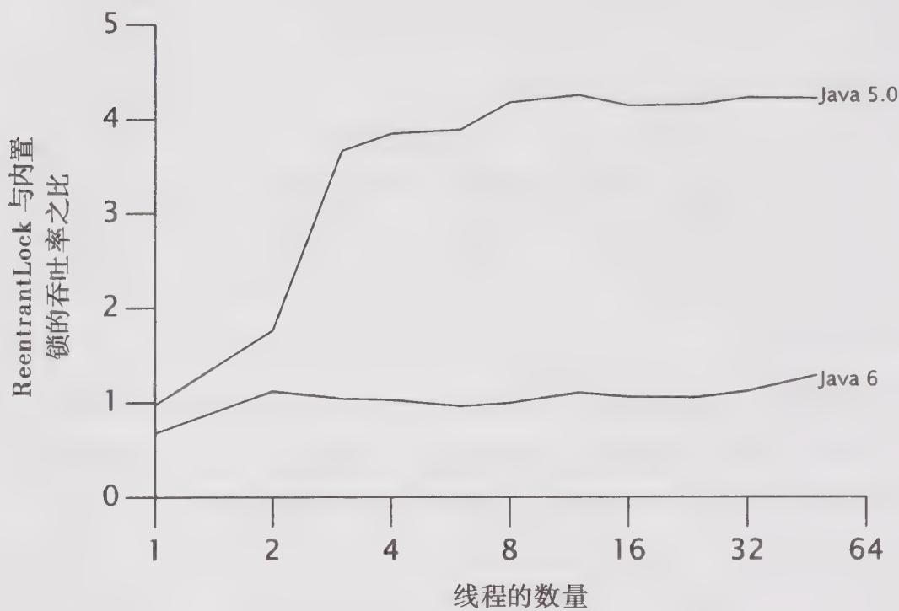

# 13.2 性能考虑因素

当把ReentrantLock添加到Java 5.0时，它能比内置锁提供更好的竞争性能。对于同步原语来说，竞争性能是可伸缩性的关键要素：如果有越多的资源被耗费在锁的管理和调度上，那么应用程序得到的资源就越少。锁的实现方式越好，将需要越少的系统调用和上下文切换，并且在共享内存总线上的内存同步通信量也越少，而一些耗时的操作将占用应用程序的计算资源。

Java 6 使用了改进后的算法来管理内置锁，与在 ReentrantLock 中使用的算法类似，该算法有效地提高了可伸缩性。图 13-1 给出了在 Java 5.0 和 Java 6 版本中，内置锁与 ReentrantLock 之间的性能差异，测试程序的运行环境是 4 路的 Opteron 系统，操作系统为 Solaris。图中的曲线表示在某个 JVM 版本中 ReentrantLock 相对于内置锁的“加速比”。在 Java 5.0 中，ReentrantLock 能提供更高的吞吐量，但在 Java 6 中，二者的吞吐量非常接近 $\Theta$ 。这里使用了与 11.5 节相同的测试程序，而这次比较的是通过一个 HashMap 在由内置锁保护以及由 ReentrantLock 保护的情况下的吞吐量。

  
图13-1 内置锁与ReentrantLock在Java5.0与Java6上的性能

在Java 5.0中，当从单线程（无竞争）变化到多线程时，内置锁的性能将急剧下降，而ReentrantLock的性能下降则更为平缓，因而它具有更好的可伸缩性。但在Java 6中，情况就完全不同了，内置锁的性能不会由于竞争而急剧下降，并且两者的可伸缩性也基本相当。

图13-1的曲线图告诉我们，像“X比Y更快”这样的表述大多是短暂的。性能和可伸缩性对于具体平台等因素都较为敏感，例如CPU、处理器数量、缓存大小以及JVM特性等，所有这些因素都可能会随着时间而发生变化。 $\Theta$

性能是一个不断变化的指标，如果在昨天的测试基准中发现X比Y更快，那么在今天就可能已经过时了。