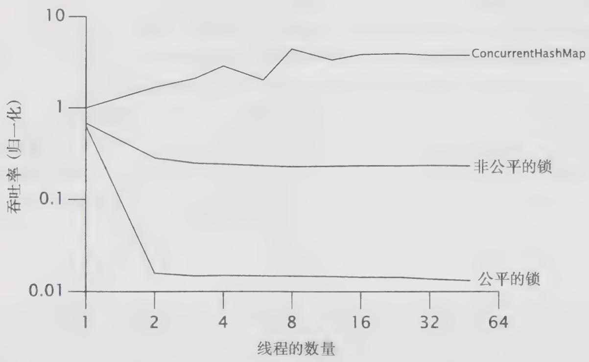

# 13.3 公平性

在ReentrantLock的构造函数中提供了两种公平性选择：创建一个非公平的锁（默认）或者一个公平的锁。在公平的锁上，线程将按照它们发出请求的顺序来获得锁，但在非公平的锁上，则允许“插队”：当一个线程请求非公平的锁时，如果在发出请求的同时该锁的状态变为可用，那么这个线程将跳过队列中所有的等待线程并获得这个锁。（在Semaphore中同样可以选择采用公平的或非公平的获取顺序。）非公平的ReentrantLock并不提倡“插队”行为，但无法防止某个线程在合适的时候进行“插队”。在公平的锁中，如果有另一个线程持有这个锁或者有其他线程在队列中等待这个锁，那么新发出请求的线程将被放入队列中。在非公平的锁中，

只有当锁被某个线程持有时，新发出请求的线程才会被放入队列中。

我们为什么不希望所有的锁都是公平的？毕竟，公平是一种好的行为，而不公平则是一种不好的行为，对不对？当执行加锁操作时，公平性将由于在挂起线程和恢复线程时存在的开销而极大地降低性能。在实际情况中，统计上的公平性保证——确保被阻塞的线程能最终获得锁，通常已经够用了，并且实际开销也小得多。有些算法依赖于公平的排队算法以确保它们的正确性，但这些算法并不常见。在大多数情况下，非公平锁的性能要高于公平锁的性能。

图13-2给出了Map的性能测试，并比较由公平的以及非公平的ReentrantLock包装的HashMap的性能，测试程序在一个4路的Opteron系统上运行，操作系统为Solaris，在绘制结果曲线时采用了对数缩放比例。从图中可以看出，公平性把性能降低了约两个数量级。不必要的话，不要为公平性付出代价。

  
图13-2 公平锁与非公平锁的性能比较

在激烈竞争的情况下，非公平锁的性能高于公平锁的性能的一个原因是：在恢复一个被挂起的线程与该线程真正开始运行之间存在着严重的延迟。假设线程A持有一个锁，并且线程B请求这个锁。由于这个锁已被线程A持有，因此B将被挂起。当A释放锁时，B将被唤醒，因此会再次尝试获取锁。与此同时，如果C也请求这个锁，那么C很可能会在B被完全唤醒之前

获得、使用以及释放这个锁。这样的情况是一种“双赢”的局面：B获得锁的时刻并没有推迟，C更早地获得了锁，并且吞吐量也获得了提高。

当持有锁的时间相对较长，或者请求锁的平均时间间隔较长，那么应该使用公平锁。在这些情况下，“插队”带来的吞吐量提升（当锁处于可用状态时，线程却还处于被唤醒的过程中）则可能不会出现。

与默认的ReentrantLock一样，内置加锁并不会提供确定的公平性保证，但在大多数情况下，在锁实现上实现统计上的公平性保证已经足够了。Java语言规范并没有要求JVM以公平的方式来实现内置锁，而在各种JVM中也没有这样做。ReentrantLock并没有进一步降低锁的公平性，而只是使一些已经存在的内容更明显。