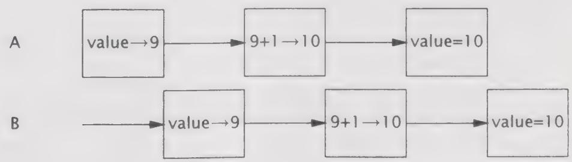

# 1.3.1 安全性问题

线程安全性可能是非常复杂的，在没有充足同步的情况下，多个线程中的操作执行顺序是不可预测的，甚至会产生奇怪的结果。在程序清单1-1的UnsafeSequence类中将产生一个整数值序列，该序列中的每个值都是唯一的。在这个类中简要地说明了多个线程之间的交替操作将如何导致不可预料的结果。在单线程环境中，这个类能正确地工作，但在多线程环境中则不能。

程序清单1-1 非线程安全的数值序列生成器  
```txt
@NotThreadSafe   
public class UnsafeSequence{ private int value; /\*\*返回一个唯一的数值。\*/ public int getNext() { return value++; } 
```


UnsafeSequence 的问题在于，如果执行时机不对，那么两个线程在调用 getNext 时会得到相同的值。在图 1-1 中给出了这种错误情况。虽然递增运算 someVariable++ 看上去是单个操作，但事实上它包含三个独立的操作：读取 value，将 value 加 1，并将计算结果写入 value。由于运行时可能将多个线程之间的操作交替执行，因此这两个线程可能同时执行读操作，从而使它们得到相同的值，并都将这个值加 1。结果就是，在不同线程的调用中返回了相同的数值。

  
图1-1 UnsafeSequence.getNext()的错误执行情况

在图1-1中给出了不同线程之间的一种交替执行情况。在图中，执行时序按照从左到右的顺序递增，每行表示一个线程的动作。这些交替执行示意图给出的是最糟糕的执行情况，目的是为了说明：如果错误地假设程序中的操作将按照某种特定顺序来执行，那么会存在各种可能的危险。

在 UnsafeSequence 中使用了一个非标准的标注：@NotThreadSafe。这是在本书中使用的几个自定义标注之一，用于说明类和类成员的并发属性。（其他标注包括 @ThreadSafe 和 @Immutable，请参见附录 A 的详细信息）。线程安全性标注在许多方面都是有用的。如果用 @ThreadSafe 来标注某个类，那么开发人员可以放心地在多线程环境下使用这个类，维护人员也会发现它能保证线程安全性，而软件分析工具还可以识别出潜在的编码错误。

在 UnsafeSequence 类中说明的是一种常见的并发安全问题，称为竞态条件（Race Condition）。在多线程环境下，getValue 是否会返回唯一的值，要取决于运行时对线程中操作的交替执行方式，这并不是我们希望看到的情况。

由于多个线程要共享相同的内存地址空间，并且是并发运行，因此它们可能会访问或修改其他线程正在使用的变量。当然，这是一种极大的便利，因为这种方式比其他线程间通信机制更容易实现数据共享。但它同样也带来了巨大的风险：线程会由于无法预料的数据变化而发生错误。当多个线程同时访问和修改相同的变量时，将会在串行编程模型中引入非串行因素，而这种非串行性是很难分析的。要使多线程程序的行为可以预测，必须对共享变量的访问操作进行协同，这样才不会在线程之间发生彼此干扰。幸运的是，Java 提供了各种同步机制来协同这种访问。

通过将getNext修改为一个同步方法，可以修复UnsafeSequence中的错误，如程序清单1-2中的Sequence $\ominus$ ，这个类可以防止图1-1中错误的交替执行情况。（第2章和第3章将进一步分析这个类的工作原理。）

程序清单1-2 线程安全的数值序列生成器  
```java
@ThreadSafe   
public class Sequence { @GuardedBy("this") private int Value; public synchronized int getNext() { return Value++; 1 
```

如果没有同步，那么无论是编译器、硬件还是运行时，都可以随意安排操作的执行时间和顺序，例如对寄存器或者处理器中的变量进行缓存，而这些被缓存的变量对于其他线程来说是暂时（甚至永久）不可见的。虽然这些技术有助于实现更优的性能，并且通常也是值得采用的方法，但它们也为开发人员带来了负担，因为开发人员必须找出这些数据在哪些位置被多个线程共享，只有这样才能使这些优化措施不破坏线程安全性。（第16章将详细介绍JVM实现了哪些顺序保证，以及同步将如何影响这些保证，但如果遵循第2章和第3章给出的指导原则，那么就可以绕开这些底层细节问题。）