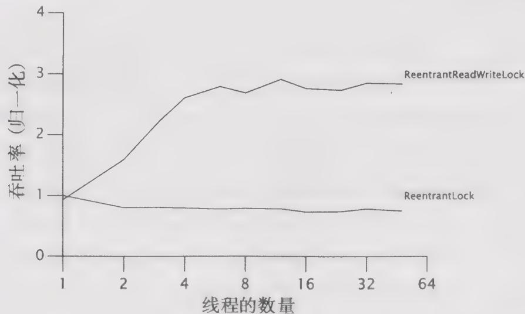

# 程序清单13-7 用读一写锁来包装Map

```java
public class ReadWriteMap<K, V> {
    private final Map<K, V> map;
    private final ReadWriteLock lock = new ReentrantReadWriteLock();
    private final Lock r = lock.readLock();
    private final Lock w = lock.writeLock();
    public ReadWriteMap(Map<K, V> map) {
        this.map = map;
    }
} 
```

$\ominus$ 做出这种修改的一个原因是：在 Java 5.0 的锁实现中，无法区别一个线程是首次请求读取锁，还是可重入锁请求，从而可能使公平的读一写锁发生死锁。  
ReadWriteMap并没有实现Map，因为实现一些方法（例如entrySet和values）是非常困难的，况且“简单”的方法通常已经足够了。

```txt
public V put(K key, V value) {
    w.lock();
    try {
        return map.put(key, value);
    } finally {
        w.unlock();
    }
} // 对 remove(), putAll(), clear() 等方法执行相同的操作
public V get(Object key) {
    r.lock();
    try {
        return map.get(key);
    } finally {
        r.unlock();
    }
} // 对其他只读的 Map 方法执行相同的操作
```

图13-3给出了分别用ReentrantLock和ReadWriteLock来封装ArrayList的吞吐量比较，测试程序在4路的Opteron系统上运行，操作系统为Solaris。这里使用的测试程序与本书使用的Map性能测试基本类似——每个操作随机地选择一个值并在容器中查找这个值，并且只有少量的操作会修改这个容器中的内容。

  
图13-3 读一写锁的性能