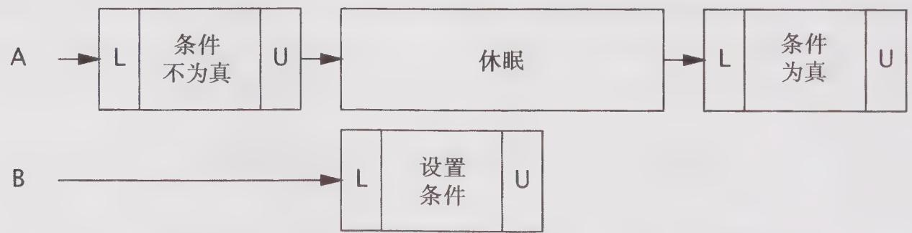

# 14.1.2 示例：通过轮询与休眠来实现简单的阻塞

程序清单 14-5 中的 SleepyBoundedBuffer 尝试通过 put 和 take 方法来实现一种简单的“轮询与休眠”重试机制，从而使调用者无须在每次调用时都实现重试逻辑。如果缓存为空，那么 take 将休眠并直到另一个线程在缓存中放入一些数据；如果缓存是满的，那么 put 将休眠并直到另一个线程从缓存中移除一些数据，以便有空间容纳新的数据。这种方法将前提条件的管理操作封装起来，并简化了对缓存的使用——这正是朝着正确的改进方向迈出了一步。

程序清单14-5 使用简单阻塞实现的有界缓存  
@ThreadSafe   
public class SleepyBoundedBuffer $<  \mathrm{V}>$ extends BaseBoundedBuffer $<  \mathrm{V}>$ { public SleepyBoundedBuffer(int size){ super(size); } public void put(Vv) throws InterruptedException { while(true）{ synchronized(this）{ if(!isFull（)){ doPut(v); return; } }

```java
Thread.sleep(SLEEP_GRANULARITY); } public V take() throws InterruptedException { while (true) { synchronized (this) { if (!isEmpty()) return doTake(); } Thread.sleep(SLEEP_GRANULARITY); } } 
```

SleepyBoundedBuffer的实现远比之前的实现复杂。缓存代码必须在持有缓存锁的时候才能测试相应的状态条件，因为表示状态条件的变量是由缓存锁保护的。如果测试失败，那么当前执行的线程将首先释放锁并休眠一段时间，从而使其他线程能够访问缓存。当线程醒来时，它将重新请求锁并再次尝试执行操作，因而线程将反复地在休眠以及测试状态条件等过程之间进行切换，直到可以执行操作为止。

从调用者的角度看，这种方法能很好地运行，如果某个操作可以执行，那么就立即执行，否则就阻塞，调用者无须处理失败和重试。要选择合适的休眠时间间隔，就需要在响应性与CPU使用率之间进行权衡。休眠的间隔越小，响应性就越高，但消耗的CPU资源也越高。图14-1给出了休眠间隔对响应性的影响：在缓存中出现可用空间的时刻与线程醒来并再次检查的时刻之间可能存在延迟。

  
图14-1 在线程刚刚进入休眠后，条件立即变为真，此时将存在不必要的休眠时间

SleepyBoundedBuffer 对调用者提出了一个新的需求：处理 InterruptedException。当一个方法由于等待某个条件变成真而阻塞时，需要提供一种取消机制（请参见第 7 章）。与大多数具备良好行为的阻塞库方法一样，SleepyBoundedBuffer 通过中断来支持取消，如果该方法被中断，那么将提前返回并抛出 InterruptedException。

这种通过轮询与休眠来实现阻塞操作的过程需要付出大量的努力。如果存在某种挂起线程的方法，并且这种方法能够确保当某个条件成真时线程立即醒来，那么将极大地简化实现工作。这正是条件队列实现的功能。