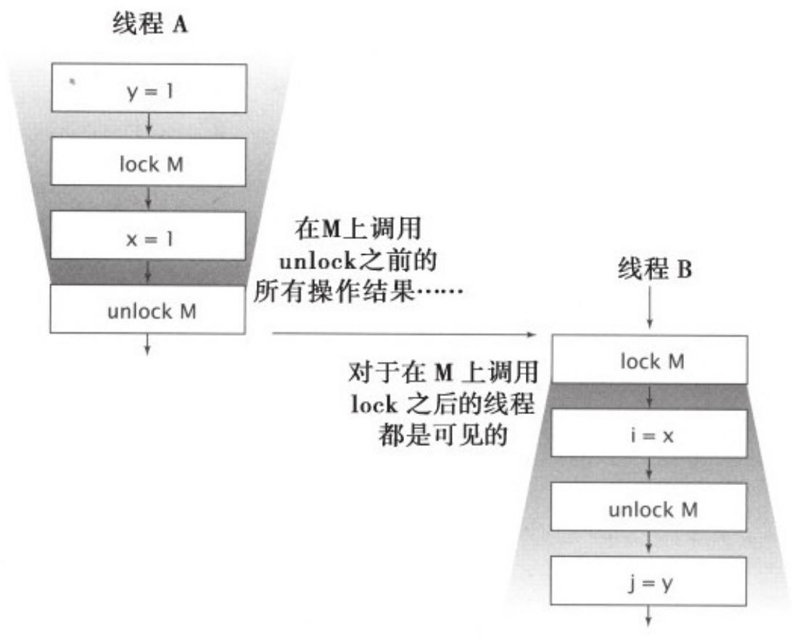

# 3.1.3 加锁与可⻅性

内置锁可以⽤于确保某个线程以⼀种可预测的⽅式来查看另⼀个线程的执⾏结果，如图3-1所⽰。当线程A执⾏某个同步代码块时，线程B随后进⼊由同⼀个锁保护的同步代码块，在这种情况下可以保证，在锁被释放之前，A看到的变量值在B获得锁后同样可以由B看到。换句话说，当线程B执⾏由锁保护的同步代码块时，可以看到线程A之前在同⼀个同步代码块中的所有操作结果。如果没有同步，那么就⽆法实现上述保证。

  
图 3-1 同步的可⻅性保证

现在，我们可以进⼀步理解为什么在访问某个共享且可变的变量时要求所有线程在同⼀个锁上同步，就是为了确保某个线程写⼊该变量的

值对于其他线程来说都是可⻅的。否则，如果⼀个线程在未持有正确锁的情况下读取某个变量，那么读到的可能是⼀个失效值。

加锁的含义不仅仅局限于互斥⾏为，还包括内存可⻅性。为了确保所有线程都能看到共享变量的最新值，所有执⾏读操作或者写操作的线程都必须在同⼀个锁上同步。