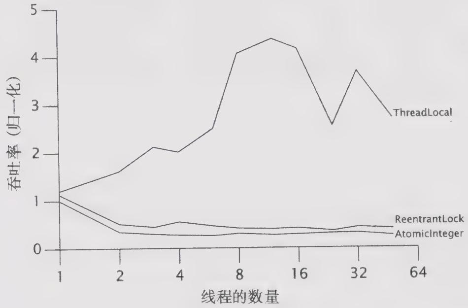
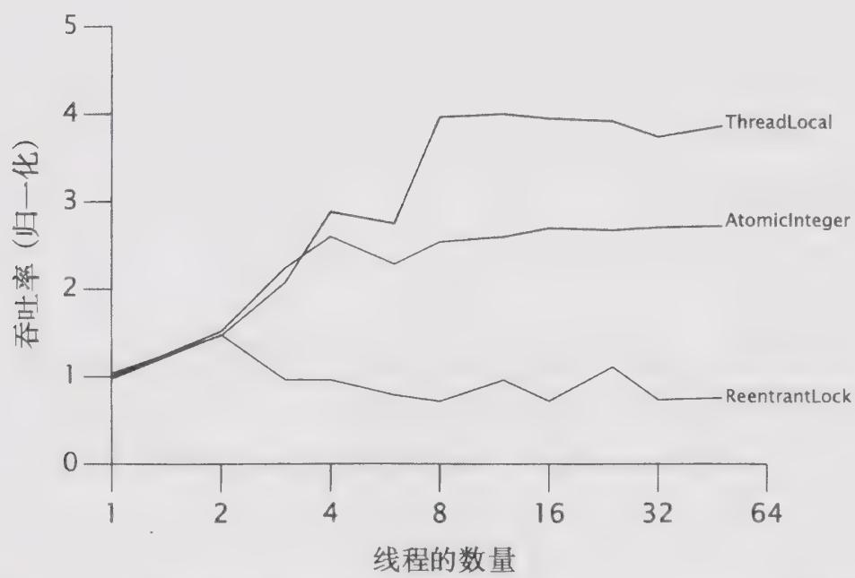

# 15.3.2 性能比较：锁与原子变量

为了说明锁和原子变量之间的可伸缩性差异，我们构造了一个测试基准，其中将比较伪随机数字生成器(PRNG)的几种不同实现。在PRNG中，在生成下一个随机数字时需要用到上一个数字，所以在PRNG中必须记录前一个数值并将其作为状态的一部分。

程序清单15-4和程序清单15-5给出了线程安全的PRNG的两种实现，一种使用Reentrant-Lock,另一种使用AtomicInteger。测试程序将反复调用它们，在每次迭代中将生成一个随机数字（在此过程中将读取并修改共享的seed状态），并执行一些仅在线程本地数据上执行的“繁忙”迭代。这种方式模拟了一些典型操作，以及一些在共享状态以及线程本地状态上的操作。

程序清单15-4 基于ReentrantLock实现的随机数生成器  
```java
@ThreadSafe
public class ReentrantLockPseudoRandom extends PseudoRandom {
    private final Lock lock = new ReentrantLock(false); 
```

private int seed;   
ReentrantLockPseudoRandom(int seed) { this.seed $=$ seed;   
public int nextInt(int n){ lock.lock(); try{ int s $=$ seed; seed $=$ calculateNext(s); int remainder $= \mathrm{s}\%$ n; return remainder $>0?$ remainder:remainder $+\mathsf{n};$ 1 finally{ lock.unlock(); }   
}

程序清单 15-5 基于 AtomicInteger 实现的随机数生成器  
@ThreadSafe   
public class AtomicPseudoRandom extends PseudoRandom { private AtomicInteger seed; AtomicPseudoRandom(int seed) { this.seed $=$ new AtomicInteger(seed); } public int nextInt(int n){ while(true）{ int s $=$ seed.get(); int nextSeed $=$ calculateNext(s); if (seed compareAndSet(s, nextSeed)) { int remainder $= \mathrm{s}\%$ n; return remainder $>0?$ remainder : remainder $+\mathrm{n};$ 1 1

图15-1和图15-2给出了在每次迭代中工作量较低以及适中情况下的吞吐量。如果线程本地的计算量较少，那么在锁和原子变量上的竞争将非常激烈。如果线程本地的计算量较多，那么在锁和原子变量上的竞争会降低，因为在线程中访问锁和原子变量的频率将降低。

从这些图中可以看出，在高度竞争的情况下，锁的性能将超过原子变量的性能，但在更真实的竞争情况下，原子变量的性能将超过锁的性能。这是因为锁在发生竞争时会挂起线程，从而降低了CPU的使用率和共享内存总线上的同步通信量。（这类似于在生产者－消费者设计

中的可阻塞生产者，它能降低消费者上的工作负载，使消费者的处理速度赶上生产者的处理速度。）另一方面，如果使用原子变量，那么发出调用的类负责对竞争进行管理。与大多数基于CAS的算法一样，AtomicPseudoRandom在遇到竞争时将立即重试，这通常是一种正确的方法，但在激烈竞争环境下却导致了更多的竞争。

  
图15-1 在竞争程度较高情况下的Lock与AtomicInteger的性能

  
图15-2 在竞争程度适中情况下的Lock与AtomicInteger的性能

在批评 AtomicPseudoRandom 写得太糟糕或者原子变量比锁更糟糕之前，应该意识到图 15-1 中竞争级别过高而有些不切实际：任何一个真实的程序都不会除了竞争锁或原子变量，其他什么工作都不做。在实际情况中，原子变量在可伸缩性上要高于锁，因为在应对常见的竞争程度时，原子变量的效率会更高。

锁与原子变量在不同竞争程度上的性能差异很好地说明了各自的优势和劣势。在中低程度的竞争下，原子变量能提供更高的可伸缩性，而在高强度的竞争下，锁能够更有效地避免竞

争。（在单CPU的系统上，基于CAS的算法在性能上同样会超过基于锁的算法，因为CAS在单CPU的系统上通常能执行成功，只有在偶然情况下，线程才会在执行读-改-写的操作过程中被其他线程抢占执行。）

在图15-1和图15-2中都包含了第三条曲线，它是一个使用ThreadLocal来保存PRNG状态的PseudoRandom。这种实现方法改变了类的行为，即每个线程都只能看到自己私有的伪随机数字序列，而不是所有线程共享同一个随机数序列，这说明了，如果能够避免使用共享状态，那么开销将会更小。我们可以通过提高处理竞争的效率来提高可伸缩性，但只有完全消除竞争，才能实现真正的可伸缩性。