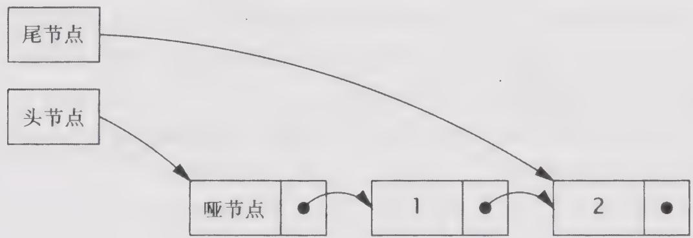
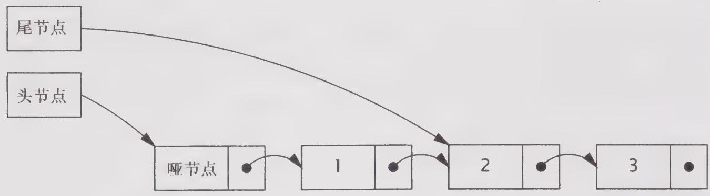
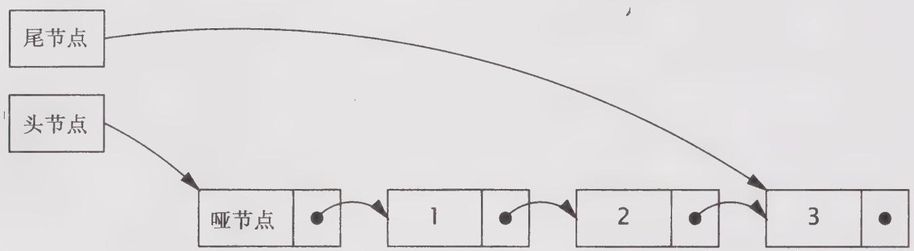

# 15.4.2 非阻塞的链表

到目前为止，我们已经看到了两个非阻塞算法，计数器和栈，它们很好地说明了CAS的基本使用模式：在更新某个值时存在不确定性，以及在更新失败时重新尝试。构建非阻塞算法的技巧在于：将执行原子修改的范围缩小到单个变量上。这在计数器中很容易实现，在栈中也很简单，但对于一些更复杂的数据结构，例如队列、散列表或树，则要复杂得多。

链接队列比栈更为复杂，因为它必须支持对头节点和尾结点的快速访问。因此，它需要单独维护的头指针和尾指针。有两个指针指向位于尾部的节点：当前最后一个元素的 next 指针，以及尾节点。当成功地插入一个新元素时，这两个指针都需要采用原子操作来更新。初看起来，这个操作无法通过原子变量来实现。在更新这两个指针时需要不同的 CAS 操作，并且如果第一个 CAS 成功，但第二个 CAS 失败，那么队列将处于不一致的状态。而且，即使这两个 CAS 都成功了，那么在执行这两个 CAS 之间，仍可能有另一个线程会访问这个队列。因此，在为链接队列构建非阻塞算法时，需要考虑到这两种情况。

我们需要使用一些技巧。第一个技巧是，即使在一个包含多个步骤的更新操作中，也要确保数据结构总是处于一致的状态。这样，当线程B到达时，如果发现线程A正在执行更新，那么线程B就可以知道有一个操作已部分完成，并且不能立即开始执行自己的更新操作。然后，B可以等待（通过反复检查队列的状态）并直到A完成更新，从而使两个线程不会相互干扰。

虽然这种方法能够使不同的线程“轮流”访问数据结构，并且不会造成破坏，但如果一个线程在更新操作中失败了，那么其他的线程都无法再访问队列。要使得该算法成为一个非阻塞算法，必须确保当一个线程失败时不会妨碍其他线程继续执行下去。因此，第二个技巧是，如果当B到达时发现A正在修改数据结构，那么在数据结构中应该有足够多的信息，使得B能完成A的更新操作。如果B“帮助”A完成了更新操作，那么B可以执行自己的操作，而不用等待A的操作完成。当A恢复后再试图完成其操作时，会发现B已经替它完成了。

在程序清单15-7的LinkedQueue中给出了Michael-Scott提出的非阻塞链接队列算法中的插入部分(Michael and Scott, 1996)，在ConcurrentLinkedQueue中使用的正是该算法。在许多队列算法中，空队列通常都包含一个“哨兵（Sentinel）节点”或者“哑（Dummy）节点”，并且头节点和尾节点在初始化时都指向该哨兵节点。尾节点通常要么指向哨兵节点（如果队列为空），即队列的最后一个元素，要么（当有操作正在执行更新时）指向倒数第二个元素。图15-3给出了一个处于正常状态（或者说稳定状态）的包含两个元素的队列。

程序清单 15-7 Michael-Scott(Michael and Scott, 1996) 非阻塞算法中的插入算法  
```java
@ThreadSafe   
public class LinkedQueue <E> { private static class Node <E> { final E item; final AtomicReference<Node<E>> next; public Node(E item, Node<E> next) { this.item = item; this.next = new AtomicReference<Node<E>> (next); } 
```

}   
private final Node $\vDash$ dummy $=$ new Node $\vDash$ (null, null); private final AtomicReference $\vDash$ Node $\vDash$ head $=$ new AtomicReference $\vDash$ Node $\vDash$ (dummy); private final AtomicReference $\vDash$ Node $\vDash$ tail $=$ new AtomicReference $\vDash$ Node $\vDash$ (dummy); public boolean put(E item){ Node $\vDash$ newNode $=$ new Node $\vDash$ (item, null); while(true）{ Node $\vDash$ curTail $=$ tail.get(); Node $\vDash$ tailNext $=$ curTail.next.get(); if(curTail $= =$ tail.get()）{ if(tailNext！ $= =$ null）{ //队列处于中间状态，推进尾节点 tail compareAndSet(curTail,tailNext); }else{ //处于稳定状态，尝试插入新节点 if(curTail.next compareAndSet(null,newNode)) { //插入操作成功，尝试推进尾节点 tail compareAndSet(curTail,newNode); return true; 1 } } } } } } }

  
图15-3 处于稳定状态并包含两个元素的对立

当插入一个新的元素时，需要更新两个指针。首先更新当前最后一个元素的 next 指针，将新节点链接到列表队尾，然后更新尾节点，将其指向这个新元素。在这两个操作之间，队列处于一种中间状态，如图 15-4 所示。在第二次更新完成后，队列将再次处于稳定状态，如图 15-5 所示。

实现这两个技巧时的关键点在于：当队列处于稳定状态时，尾节点的 next 域将为空，如果队列处于中间状态，那么 tail.next 将为非空。因此，任何线程都能够通过检查 tail.next 来获取队列当前的状态。而且，当队列处于中间状态时，可以通过将尾节点向前移动一个节点，从而结束其他线程正在执行的插入元素操作，并使得队列恢复为稳定状态。

  
图15-4 在插入过程中处于中间状态的对立

  
图15-5 在插入操作完成后，队列再次处于稳定状态

LinkedQueue.put方法在插入新元素之前，将首先检查队列是否处于中间状态（步骤A）。如果是，那么有另一个线程正在插入元素（在步骤C和D之间）。此时当前线程不会等待其他线程执行完成，而是帮助它完成操作，并将尾节点向前推进一个节点（步骤B）。然后，它将重复执行这种检查，以免另一个线程已经开始插入新元素，并继续推进尾节点，直到它发现队列处于稳定状态之后，才会开始执行自己的插入操作。

由于步骤C中的CAS将把新节点链接到队列尾部，因此如果两个线程同时插入元素，那么这个CAS将失败。在这样的情况下，并不会造成破坏：不会发生任何变化，并且当前的线程只需重新读取尾节点并再次重试。如果步骤C成功了，那么插入操作将生效，第二个CAS（步骤D）被认为是一个“清理操作”，因为它既可以由执行插入操作的线程来执行，也可以由其他任何线程来执行。如果步骤D失败，那么执行插入操作的线程将返回，而不是重新执行CAS，因为不再需要重试——另一个线程已经在步骤B中完成了这个工作。这种方式能够工作，因为在任何线程尝试将一个新节点插入到队列之前，都会首先通过检查tail.next是否非空来判断是否需要清理队列。如果是，它首先会推进尾节点（可能需要执行多次），直到队列处于稳定状态。