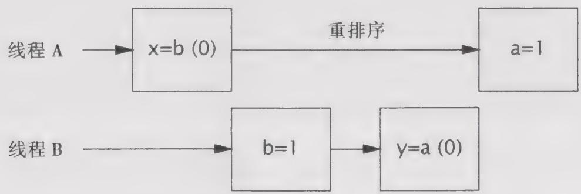

# 16.1.2 重排序

在第2章中介绍竞态条件和原子性故障时，我们使用了交互图来说明：在没有充分同步的程序中，如果调度器采用不恰当的方式来交替执行不同线程的操作，那么将导致不正确的结果。更糟的是，JMM还使得不同线程看到的操作执行顺序是不同的，从而导致在缺乏同步的情况下，要推断操作的执行顺序将变得更加复杂。各种使操作延迟或者看似乱序执行的不同原因，都可以归为重排序。

在程序清单 16-1 的 PossibleReordering 中说明了，在没有正确同步的情况下，即使要推断最简单的并发程序的行为也很困难。很容易想象 PossibleReordering 是如何输出（1，0）或（0，1）或（1，1）的：线程 A 可以在线程 B 开始之前就执行完成，线程 B 也可以在线程 A 开始之

前执行完成，或者二者的操作交替执行。但奇怪的是，PossibleReordering 还可以输出（0，0）。由于每个线程中的各个操作之间不存在数据流依赖性，因此这些操作可以乱序执行。（即使这些操作按照顺序执行，但在将缓存刷新到主内存的不同时序中也可能出现这种情况，从线程 B 的角度看，线程 A 中的赋值操作可能以相反的次序执行。）图 16-1 给出了一种可能由重排序导致的交替执行方式，在这种情况中会输出（0，0）。

程序清单16-1 如果在程序中没有包含足够的同步，那么可能产生奇怪的结果（不要这么做）  
```java
public class PossibleReordering {
    static int x = 0, y = 0;
    static int a = 0, b = 0;
    public static void main(String[] args) throws InterruptedException {
        Thread one = new Thread(new Runnable() {
            public void run() {
                a = 1;
                x = b;
            }
        });
        Thread other = new Thread(new Runnable() {
            public void run() {
                b = 1;
                y = a;
            }
        });
        one.start(); other.start();
        one.join(); other.join();
        System.out.println(" ( " + x + ", " + y + ")" );
    }
} 
```


  
图16-1 PossibleReordering中存在重排序的交替执行

PossibleReordering 是一个简单程序，但要列举出它所有可能的结果却非常困难。内存级的重排序会使程序的行为变得不可预测。如果没有同步，那么推断出执行顺序将是非常困难的，而要确保在程序中正确地使用同步却是非常容易的。同步将限制编译器、运行时和硬件对内存操作重排序的方式，从而在实施重排序时不会破坏 JMM 提供的可见性保证。