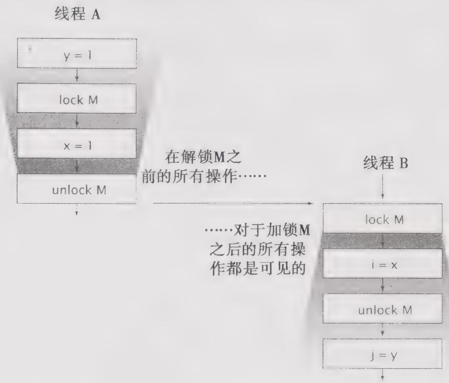

# 16.1.3 Java内存模型简介

Java内存模型是通过各种操作来定义的，包括对变量的读/写操作，监视器的加锁和释放操作，以及线程的启动和合并操作。JMM为程序中所有的操作定义了一个偏序关系 $\Theta$ ，称之为Happens-Before。要想保证执行操作B的线程看到操作A的结果（无论A和B是否在同一个线程中执行），那么在A和B之间必须满足Happens-Before关系。如果两个操作之间缺乏Happens-Before关系，那么JVM可以对它们任意地重排序。

当一个变量被多个线程读取并且至少被一个线程写入时，如果在读操作和写操作之间没有依照 Happens-Before 来排序，那么就会产生数据竞争问题。在正确同步的程序中不存在数据竞争，并会表现出串行一致性，这意味着程序中的所有操作都会按照一种固定的和全局的顺序执行。

Happens-Before 的规则包括：

程序顺序规则。如果程序中操作A在操作B之前，那么在线程中A操作将在B操作之前执行。

监视器锁规则。在监视器锁上的解锁操作必须在同一个监视器锁上的加锁操作之前执行。

volatile 变量规则。对 volatile 变量的写入操作必须在对该变量的读操作之前执行③。

线程启动规则。在线程上对 Thread.Start 的调用必须在该线程中执行任何操作之前执行。

线程结束规则。线程中的任何操作都必须在其他线程检测到该线程已经结束之前执行，或者从 Thread.join 中成功返回，或者在调用 Thread.isAlive 时返回 false。

中断规则。当一个线程在另一个线程上调用 interrupt 时，必须在被中断线程检测到 interrupt 调用之前执行（通过抛出 Exception，或者调用 isInterrupted 和 interrupted）。

终结器规则。对象的构造函数必须在启动该对象的终结器之前执行完成。

传递性。如果操作 A 在操作 B 之前执行，并且操作 B 在操作 C 之前执行，那么操作 A 必须在操作 C 之前执行。

虽然这些操作只满足偏序关系，但同步操作，如锁的获取与释放等操作，以及volatile变量的读取与写入操作，都满足全序关系。因此，在描述Happens-Before关系时，就可以使用“后续的锁获取操作”和“后续的volatile变量读取操作”等表达术语。

图16-2给出了当两个线程使用同一个锁进行同步时，在它们之间的Happens-Before关系。

在线程A内部的所有操作都按照它们在源程序中的先后顺序来排序，在线程B内部的操作也是如此。由于A释放了锁M，并且B随后获得了锁M，因此A中所有在释放锁之前的操作，也就位于B中请求锁之后的所有操作之前。如果这两个线程是在不同的锁上进行同步的，那么就不能推断它们之间的动作顺序，因为在这两个线程的操作之间并不存在Happens-Before关系。

  
图16-2 在Java内存模型中说明Happens-Before关系