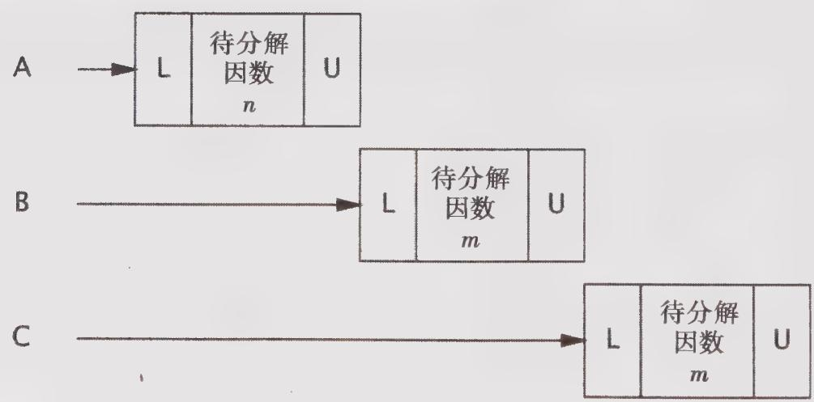

# 2.5 活跃性与性能

在 UnsafeCachingFactorizer 中，我们通过在因数分解 Servlet 中引入了缓存机制来提升性能。在缓存中需要使用共享状态，因此需要通过同步来维护状态的完整性。然而，如果使用 SynchronizedFactorizer 中的同步方式，那么代码的执行性能将非常糟糕。SynchronizedFactorizer

中采用的同步策略是，通过Servlet对象的内置锁来保护每一个状态变量，该策略的实现方式也就是对整个service方法进行同步。虽然这种简单且粗粒度的方法能确保线程安全性，但付出的代价却很高。

由于service是一个synchronized方法，因此每次只有一个线程可以执行。这就背离了Servlet框架的初衷，即Servlet需要能同时处理多个请求，这在负载过高的情况下将给用户带来糟糕的体验。如果Servlet在对某个大数值进行因数分解时需要很长的执行时间，那么其他的客户端必须一直等待，直到Servlet处理完当前的请求，才能开始另一个新的因数分解运算。如果在系统中有多个CPU系统，那么当负载很高时，仍然会有处理器处于空闲状态。即使一些执行时间很短的请求，比如访问缓存的值，仍然需要很长时间，因为这些请求都必须等待前一个请求执行完成。

图2-1给出了当多个请求同时到达因数分解Servlet时发生的情况：这些请求将排队等待处理。我们将这种Web应用程序称之为不良并发(PoorConcurrency)应用程序：可同时调用的数量，不仅受到可用处理资源的限制，还受到应用程序本身结构的限制。幸运的是，通过缩小同步代码块的作用范围，我们很容易做到既确保Servlet的并发性，同时又维护线程安全性。要确保同步代码块不要过小，并且不要将本应是原子的操作拆分到多个同步代码块中。应该尽量将不影响共享状态且执行时间较长的操作从同步代码块中分离出去，从而在这些操作的执行过程中，其他线程可以访问共享状态。

  
图2-1 SynchronizedFactorizer中的不良并发

程序清单2-8中的CachedFactorizer将Servlet的代码修改为使用两个独立的同步代码块，每个同步代码块都只包含一小段代码。其中一个同步代码块负责保护判断是否只需返回缓存结果的“先检查后执行”操作序列，另一个同步代码块则负责确保对缓存的数值和因数分解结果进行同步更新。此外，我们还重新引入了“命中计数器”，添加了一个“缓存命中”计数器，并在第一个同步代码块中更新这两个变量。由于这两个计数器也是共享可变状态的一部分，因此必须在所有访问它们的位置上都使用同步。位于同步代码块之外的代码将以独占方式来访问局部（位于栈上的）变量，这些变量不会在多个线程间共享，因此不需要同步。

程序清单2-8 缓存最近执行因数分解的数值及其计算结果的Servlet  
```java
@ThreadSafe   
public class CachedFactorizer implements Servlet { @GuardedBy("this") private AtomicInteger lastNumber; @GuardedBy("this") private AtomicInteger[] lastFactors; @GuardedBy("this") private long hits; @GuardedBy("this") private long cacheHits; public synchronized long getHits() { return hits; } public synchronized double getCacheHitRatio() { return (double) cacheHits / (double) hits; }   
public void service(ServletRequest req, ServletResponse resp) { AtomicInteger i = extractFromRequest(req); AtomicInteger[] factors = null; synchronized (this) { ++hits; if (i.equals(lastNumber)) { ++cacheHits; factors = lastFactors clones(); } } if (factors == null) { factors = factor(i); synchronized (this) { lastNumber = i; lastFactors = factorsClone(); } } encodeIntoResponse(resp, factors); } 
```

在 CachedFactorizer 中不再使用 AtomicLong 类型的命中计数器，而是使用了一个 long 类型的变量。当然也可以使用 AtomicLong 类型，但使用 CountingFactorizer 带来的好处更多。对在单个变量上实现原子操作来说，原子变量是很有用的，但由于我们已经使用了同步代码块来构造原子操作，而使用两种不同的同步机制不仅会带来混乱，也不会在性能或安全性上带来任何好处，因此在这里不使用原子变量。

重新构造后的CachedFactorizer实现了在简单性（对整个方法进行同步）与并发性（对尽可能短的代码路径进行同步）之间的平衡。在获取与释放锁等操作上都需要一定的开销，因此如果将同步代码块分解得过细（例如将++hits分解到它自己的同步代码块中），那么通常并不好，尽管这样做不会破坏原子性。当访问状态变量或者在复合操作的执行期间，CachedFactorizer需要持有锁，但在执行时间较长的因数分解运算之前要释放锁。这样既确保了线程安全性，也不会过多地影响并发性，而且在每个同步代码块中的代码路径都“足够短”。

要判断同步代码块的合理大小，需要在各种设计需求之间进行权衡，包括安全性（这个需求必须得到满足）、简单性和性能。有时候，在简单性与性能之间会发生冲突，但在CachedFactorizer中已经说明了，在二者之间通常能找到某种合理的平衡。

通常，在简单性与性能之间存在着相互制约因素。当实现某个同步策略时，一定不要盲目地为了性能而牺牲简单性（这可能会破坏安全性）。

当使用锁时，你应该清楚代码块中实现的功能，以及在执行该代码块时是否需要很长的时间。无论是执行计算密集的操作，还是在执行某个可能阻塞的操作，如果持有锁的时间过长，那么都会带来活跃性或性能问题。

当执行时间较长的计算或者可能无法快速完成的操作时（例如，网络I/O或控制台I/O），一定不要持有锁。