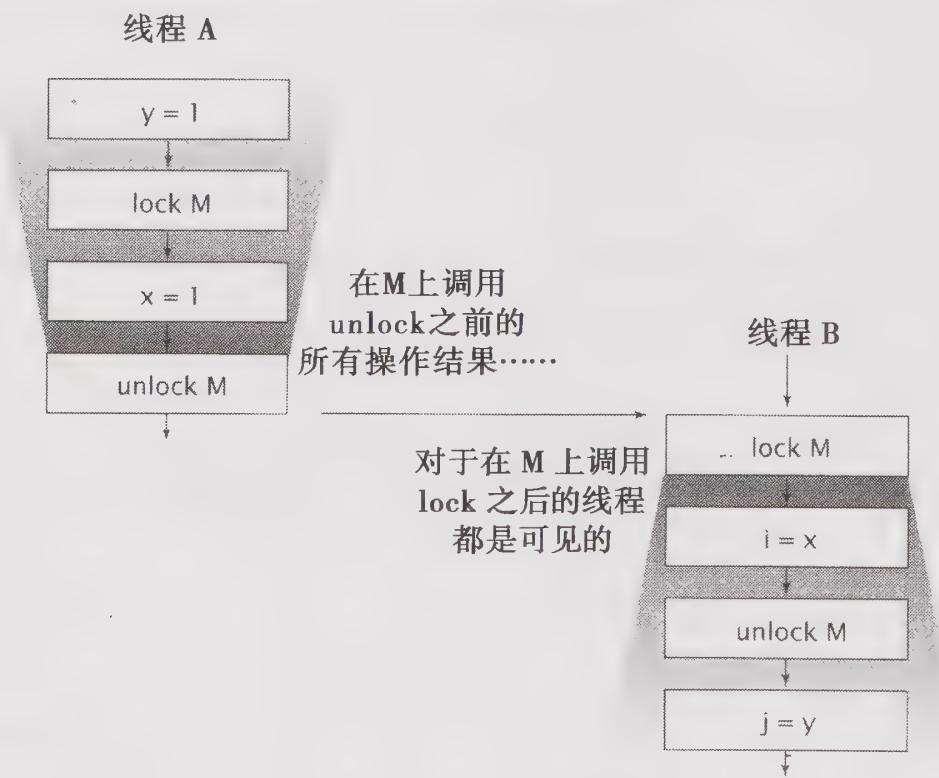

# 3.1.3 加锁与可见性

内置锁可以用于确保某个线程以一种可预测的方式来查看另一个线程的执行结果，如图3-1所示。当线程A执行某个同步代码块时，线程B随后进入由同一个锁保护的同步代码块，在这种情况下可以保证，在锁被释放之前，A看到的变量值在B获得锁后同样可以由B看到。换句话说，当线程B执行由锁保护的同步代码块时，可以看到线程A之前在同一个同步代码块中的所有操作结果。如果没有同步，那么就无法实现上述保证。

  
图3-1 同步的可见性保证

现在，我们可以进一步理解为什么在访问某个共享且可变的变量时要求所有线程在同一个锁上同步，就是为了确保某个线程写入该变量的值对于其他线程来说都是可见的。否则，如果一个线程在未持有正确锁的情况下读取某个变量，那么读到的可能是一个失效值。

加锁的含义不仅仅局限于互斥行为，还包括内存可见性。为了确保所有线程都能看到共享变量的最新值，所有执行读操作或者写操作的线程都必须在同一个锁上同步。