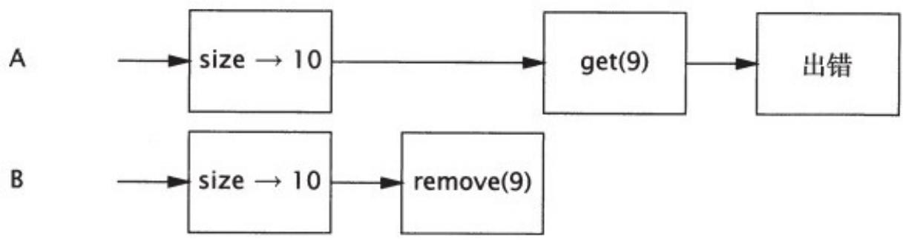

# 5.1.1 同步容器类的问题

同步容器类都是线程安全的，但在某些情况下可能需要额外的客户端加锁来保护复合操作。容器上常⻅的复合操作包括：迭代（反复访问元素，直到遍历完容器中所有元素）、跳转（根据指定顺序找到当前元素的下⼀个元素）以及条件运算，例如“若没有则添加”（检查在Map中是否存在键值K，如果没有，就加⼊⼆元组（K, V））。在同步容器类中，这些复合操作在没有客户端加锁的情况下仍然是线程安全的，但当其他线程并发地修改容器时，它们可能会表现出意料之外的⾏为。

程序清单5-1给出了在Vector中定义的两个⽅法：getLast和deleteLast，它们都会执⾏“先检查再运⾏”操作。每个⽅法⾸先都获得数组的⼤⼩，然后通过结果来获取或删除最后⼀个元素。

程序清单5-1 Vector上可能导致混乱结果的复合操作  
public static ObjectgetLast (Vector list) { int lastIndex $=$ list.size(-1; return list.get(lastIndex）;   
public static void deleteLast (Vector list){ intlastIndex $=$ list.size(-1; list.remove(lastIndex）;

这些⽅法看似没有任何问题，从某种程度上来看也确实如此——⽆论多少个线程同时调⽤它们，也不破坏Vector。但从这些⽅法的调⽤者⾓度来看，情况就不同了。如果线程A在包含10个元素的Vector上调⽤getLast，同时线程B在同⼀个Vector上调⽤deleteLast，这些操作的交替执⾏如图5-1所⽰，getLast将抛出ArrayIndexOutOfBoundsException异常。在调⽤size与调⽤getLast这两个操作之间，Vector变⼩了，因此在调⽤size时得到的索引值将不再有效。这种情况很好地遵循了Vector的规范—如果请求⼀个不存在的元素，那么将抛出⼀个异常。但这并不是getLast的调⽤者所希望得到的结果（即使在并发修改的情况下也不希望看到），除⾮Vector从⼀开始就是空的。

  
图 5-1 交替调⽤getLast和deleteLast时将抛出ArrayIndexOutOfBoundsException

由于同步容器类要遵守同步策略，即⽀持客户端加锁[1]，因此可能会创建⼀些新的操作，只要我们知道应该使⽤哪⼀个锁，那么这些新操作就与容器的其他操作⼀样都是原⼦操作。同步容器类通过其⾃⾝的锁来保护它的每个⽅法。通过获得容器类的锁，我们可以使getLast和deleteLast成为原⼦操作，并确保Vector的⼤⼩在调⽤size和get之间不会发⽣变化，如程序清单5-2所⽰。

**程序清单5-2 在使⽤客户端加锁的Vector上的复合操作**

public static ObjectgetLast (Vector list) {   
synchronized(list) {   
int lastIndex $=$ list.size() -1;   
return list.get(lastIndex）;   
}   
public static void deleteLast (Vector list){ synchronized(list){

intlastIndex $=$ list.size（）-1;   
list.remove(lastIndex）;   
}

在调⽤size和相应的get之间，Vector的⻓度可能会发⽣变化，这种⻛险在对Vector中的元素进⾏迭代时仍然会出现，如程序清单5-3所⽰。

程序清单5-3 可能抛出ArrayIndexOutOfBoundsException的迭代操作

```txt
for (int i=0; i<vector.size(); i++) 
```

```javascript
doSomething (vector.get(i)); 
```

这种迭代操作的正确性要依赖于运⽓，即在调⽤size和get之间没有线程会修改Vector。在单线程环境中，这种假设完全成⽴，但在有其他线程并发地修改Vector时，则可能导致⿇烦。与getLast⼀样，如果在对Vector进⾏迭代时，另⼀个线程删除了⼀个元素，并且这两个操作交替执⾏，那么这种迭代⽅法将抛出ArrayIndexOutOfBoundsException异常。

虽然在程序清单5-3的迭代操作中可能抛出异常，但并不意味着Vector就不是线程安全的。Vector的状态仍然是有效的，⽽抛出的异常也与其规范保持⼀致。然⽽，像在读取最后⼀个元素或者迭代等这样的简单操作中抛出异常显然不是⼈们所期望的。

我们可以通过在客户端加锁来解决不可靠迭代的问题，但要牺牲⼀些伸缩性。通过在迭代期间持有Vector的锁，可以防⽌其他线程在迭代

期间修改Vector，如程序清单5-4所⽰。然⽽，这同样会导致其他线程在迭代期间⽆法访问它，因此降低了并发性。

**程序清单5-4 带有客户端加锁的迭代**

```txt
synchronized (vector) {  
for (int i = 0; i < vector.size(); i++)  
doSomething (vector.get(i));  
} 
```

[1] 这只在Java 5.0的Javadoc中作为迭代⽰例简要地提了⼀下。