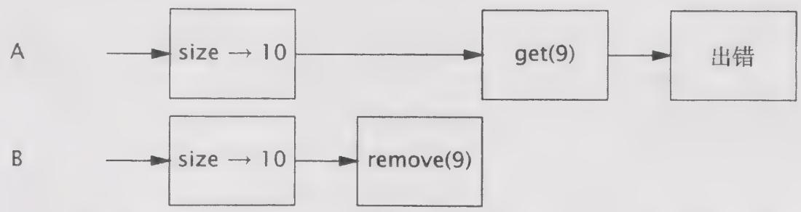

# 程序清单5-1 Vector上可能导致混乱结果的复合操作

public static Object getLast(Vector list) { int lastIndex $=$ list.size() - 1; return list.get(lastIndex); }


public static void deleteLast(Vector list) { int lastIndex $=$ list.size() - 1; list.remove(lastIndex); }

这些方法看似没有任何问题，从某种程度上来看也确实如此——无论多少个线程同时调用它们，也不破坏 Vector。但从这些方法的调用者角度来看，情况就不同了。如果线程 A 在包含 10 个元素的 Vector 上调用 getLast，同时线程 B 在同一个 Vector 上调用 deleteLast，这些操作的交替执行如图 5-1 所示，getLast 将抛出 ArrayIndexOutOfBoundsException 异常。在调用 size 与调用 getLast 这两个操作之间，Vector 变小了，因此在调用 size 时得到的索引值将不再有效。这种情况很好地遵循了 Vector 的规范——如果请求一个不存在的元素，那么将抛出一个异常。但这并不是 getLast 的调用者所希望得到的结果（即使在并发修改的情况下也不希望看到），除非 Vector 从一开始就是空的。

  
图5-1 交替调用getLast和deleteLast时将抛出ArrayIndexOutOfBoundsException

由于同步容器类要遵守同步策略，即支持客户端加锁，因此可能会创建一些新的操作，只要我们知道应该使用哪一个锁，那么这些新操作就与容器的其他操作一样都是原子操作。同步容器类通过其自身的锁来保护它的每个方法。通过获得容器类的锁，我们可以使getLast和deleteLast成为原子操作，并确保Vector的大小在调用size和get之间不会发生变化，如程序清单5-2所示。

程序清单5-2 在使用客户端加锁的Vector上的复合操作  
public static Object getLast(Vector list) { synchronized(list){ int lastIndex $=$ list.size() - 1; return list.get(lastIndex); }   
public static void deleteLast(Vector list){ synchronized(list){ int lastIndex $=$ list.size() - 1; list.remove(lastIndex); }

在调用 size 和相应的 get 之间，Vector 的长度可能会发生变化，这种风险在对 Vector 中的元素进行迭代时仍然会出现，如程序清单 5-3 所示。

程序清单5-3 可能抛出ArrayIndexOutOfBoundsException的迭代操作  
```txt
for (int i = 0; i < vector.size(); i++) doSomething.vector.get(i)); 
```

这种迭代操作的正确性要依赖于运气，即在调用 size 和 get 之间没有线程会修改 Vector。在单线程环境中，这种假设完全成立，但在有其他线程并发地修改 Vector 时，则可能导致麻烦。与 getLast 一样，如果在对 Vector 进行迭代时，另一个线程删除了一个元素，并且这两个操作交替执行，那么这种迭代方法将抛出 ArrayIndexOutOfBoundsException 异常。

虽然在程序清单5-3的迭代操作中可能抛出异常，但并不意味着Vector就不是线程安全的。Vector的状态仍然是有效的，而抛出的异常也与其规范保持一致。然而，像在读取最后一个元素或者迭代等这样的简单操作中抛出异常显然不是人们所期望的。

我们可以通过在客户端加锁来解决不可靠迭代的问题，但要牺牲一些伸缩性。通过在迭代期间持有 Vector 的锁，可以防止其他线程在迭代期间修改 Vector，如程序清单 5-4 所示。然而，这同样会导致其他线程在迭代期间无法访问它，因此降低了并发性。

程序清单5-4 带有客户端加锁的迭代  
```txt
synchronized (vector) { for (int i = 0; i < vector.size(); i++) doSomething.vector.get(i)); } 
```